# Tieko Media Platform: Website Architecture and User Flows

**Document ID:** TMP-03  
**Version:** 0.1  
**Status:** Working draft  
**Date:** 16 September 2026  
**Owner:** Tieko Media Limited  
**Product lead:** David Oluwadamilola Vanteko  
**Parent documents:** TMP-00 Master Project Brief and TMP-01 Product Requirements Document  
**Repository:** tiekomedia-alt/tieko-media-platform

## 1. Purpose

This document defines how the Tieko Media website is organised and how users move through it.

It establishes:

- Website hierarchy
- Primary and secondary navigation
- Page relationships
- Page templates
- Entry points
- Conversion routes
- Internal-linking behaviour
- Booking and enquiry flows
- Paid intelligence-report flows
- Compliance-service boundaries
- Product-discovery flows
- Paid-campaign landing-page flows
- Mobile navigation principles
- Error, empty and confirmation states

This is a Website Flow document. It does not refer to the Webflow website-building platform.

## 2. Architecture goals

The architecture must:

1. Make Tieko Media’s positioning understandable within seconds.
2. Allow visitors to enter through any important page without becoming disoriented.
3. Keep the seven launch services easy to discover.
4. Prevent the navigation from becoming crowded.
5. Connect services, insights, products, reports and case studies.
6. Make Book a Call continuously available without becoming intrusive.
7. Preserve the professional separation between Tieko Media and Vanteko & Associates.
8. Support search-engine crawling and meaningful internal linking.
9. Support individual advertising campaigns for individual services.
10. Expand cleanly as new services, products, reports and case studies are approved.

## 3. Architectural model

The platform will use a hub-and-spoke structure.

- The homepage introduces the complete Tieko system.
- Hub pages organise related content.
- Detail pages answer specific user needs and search intent.
- Proof pages support service claims.
- Insights and reports create discovery pathways.
- Every major pathway leads towards a meaningful next action.

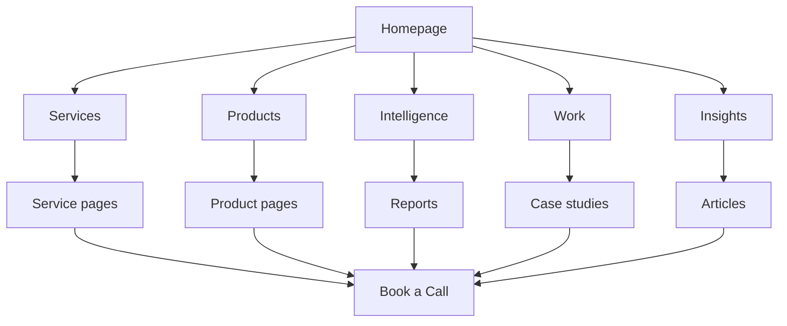

## 4. Primary navigation

### 4.1 Desktop navigation

The primary navigation will contain:

1. Services
2. Products
3. Intelligence
4. Work
5. Insights
6. About
7. Book a Call

Book a Call must be visually distinct as the primary action.

### 4.2 Services menu

The Services menu should expose the seven launch services without placing all seven items directly in the navigation bar.

Recommended menu structure:

#### Build Visibility

- Media Buying
- Digital Presence Optimisation
- Content Creation

#### Reach and Reputation

- Billboard Advertising
- Press Release Services

#### Structure and Decisions

- Compliance
- Intelligence Reports

The final menu labels may be refined during content design, but every service must remain directly accessible within one interaction from the main Services control.

### 4.3 Products menu

Initial items:

- View All Products
- TeamShuffle

LegalFlashcards9ja will only be added after its public name, status and presentation are approved.

### 4.4 Intelligence menu

Initial items:

- Intelligence Overview
- Commission a Report
- Reports and Briefings
- Research Methodology

The Reports and Briefings route may initially display a limited collection while the catalogue grows.

### 4.5 About menu

Initial items:

- About Tieko
- Team
- Contact

### 4.6 Mobile navigation

The mobile menu must:

- Open from a clearly labelled menu button
- Trap focus appropriately when presented as a modal panel
- Close using a visible control, Escape key and completed navigation
- Preserve Book a Call as a prominent action
- Use expandable service groups where helpful
- Avoid deeply nested menus
- Prevent background scrolling while open
- Remain fully usable at 200 percent zoom
- Announce its expanded or collapsed state to assistive technology

Recommended mobile order:

1. Book a Call
2. Services
3. Products
4. Intelligence
5. Work
6. Insights
7. About
8. Contact

## 5. Global utility elements

### 5.1 Header

The header must include:

- Tieko Media logo or wordmark
- Primary navigation
- Book a Call
- Accessible mobile-menu control

The header may adapt visually as the user scrolls, but must maintain readability and avoid layout shifts.

### 5.2 Footer

The footer must include:

- Short Tieko positioning statement
- Service links
- Product links
- Intelligence links
- Work and Insights
- About, Team and Contact
- Book a Call
- Privacy
- Cookies
- Terms
- Legal Disclaimer
- Accessibility
- Approved social profiles
- Business identity information
- Copyright information

The footer must not become a dumping ground for unapproved pages.

### 5.3 Breadcrumbs

Breadcrumbs are required for:

- Individual service pages
- Product pages
- Report pages
- Case studies
- Articles

Breadcrumbs must be visible, crawlable and consistent with structured data.

### 5.4 Global CTA

Book a Call must appear:

- In the header
- In major service-page conversion sections
- At the end of relevant detail pages
- In the footer

It must not appear as multiple competing buttons within the same visual region.

## 6. Sitemap

### 6.1 Core structure

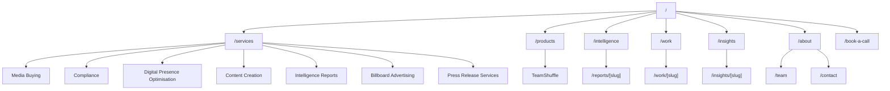

### 6.2 Required launch routes

| Area | Route | Purpose |
|---|---|---|
| Homepage | / | Positioning, discovery and primary conversion |
| Services hub | /services | Organise all launch services |
| Media Buying | /services/media-buying | Media planning, buying and optimisation |
| Compliance | /services/compliance | Compliance coordination and professional routing |
| Digital Presence Optimisation | /services/digital-presence-optimisation | Search, website, reputation and conversion improvement |
| Content Creation | /services/content-creation | Strategy and content systems |
| Intelligence Reports | /services/intelligence-reports | Paid research and report commissioning |
| Billboard Advertising | /services/billboard-advertising | Outdoor campaign planning and coordination |
| Press Release Services | /services/press-release-services | Press release preparation and distribution |
| Products hub | /products | Approved owned products |
| TeamShuffle | /products/teamshuffle | Product proof and live-product referral |
| Intelligence hub | /intelligence | Intelligence capability and report discovery |
| Reports | /reports | Approved reports and briefings |
| Report detail | /reports/[slug] | Report summary, sample and commissioning |
| Work hub | /work | Case-study discovery |
| Case study | /work/[slug] | Detailed project evidence |
| Insights hub | /insights | Articles and thought leadership |
| Article | /insights/[slug] | Search-led educational content |
| About | /about | Mission, positioning and approach |
| Team | /team | Approved people and expertise |
| Contact | /contact | General contact options |
| Book a Call | /book-a-call | Primary conversion destination |
| Privacy | /privacy | Data-use information |
| Cookies | /cookies | Cookie information and preferences |
| Terms | /terms | General website terms |
| Legal Disclaimer | /legal-disclaimer | Professional and informational limitations |
| Accessibility | /accessibility | Accessibility statement |
| Not found | Framework route | Recovery from invalid URLs |

### 6.3 Reserved future routes

The following route groups may be introduced later:

- /services/[additional-service]
- /products/[approved-product]
- /industries/[slug]
- /locations/[slug]
- /tools/[slug]
- /events/[slug]
- /authors/[slug]

They must not be generated until content quality, ownership and search intent are approved.

## 7. Page hierarchy

### Level 1: Identity and conversion

- Homepage
- Book a Call

### Level 2: Commercial and authority hubs

- Services
- Products
- Intelligence
- Work
- Insights
- About

### Level 3: Detail and evidence

- Service pages
- Product pages
- Report pages
- Case studies
- Articles
- Team
- Contact

### Level 4: Legal, supporting and system pages

- Privacy
- Cookies
- Terms
- Legal Disclaimer
- Accessibility
- Confirmation states
- Error states
- Not-found page

No important commercial page should require more than three meaningful navigation decisions from the homepage.

## 8. Homepage web flow

Recommended homepage sequence:

1. Header
2. Positioning hero
3. Primary Book a Call and secondary Explore Our Services CTA
4. Short proof or credibility strip
5. Four-capability model
6. Seven launch services
7. Selected case studies
8. Product-building proof
9. Intelligence-report feature
10. Selected insights
11. Tieko approach
12. Final Book a Call section
13. Footer

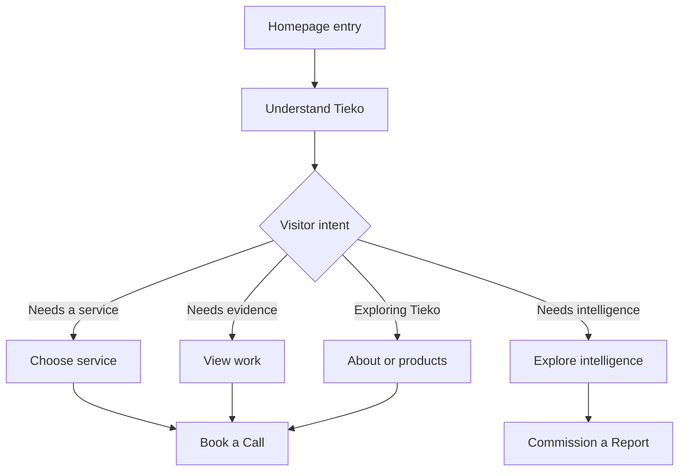

### Homepage rules

- The hero must not attempt to explain every service.
- Products and intelligence must be visible without competing with the main positioning.
- The first viewport must contain a clear statement of what Tieko is.
- The final CTA must repeat the primary action without repeating the entire hero.
- The Àmì Ribbon should guide the visual journey through selected sections.

## 9. Services hub flow

Recommended sequence:

1. Services positioning
2. Explain the four-capability model
3. Problem-based service selector
4. Seven service summaries
5. Related work
6. Relevant insights
7. Book a Call

The service selector should help users identify their route through practical questions such as:

- Do you need to reach more of the right people?
- Do you need to improve how your business appears online?
- Do you need a consistent content system?
- Do you need legal or regulatory compliance support?
- Do you need research before making a decision?
- Do you need outdoor visibility?
- Do you have an announcement that requires media distribution?

## 10. Standard service-page flow

Each service page should follow a shared conversion logic while allowing service-specific content.

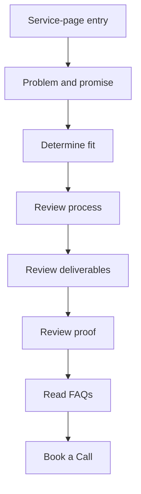

Recommended page sequence:

1. Breadcrumb
2. Service-specific hero
3. Who the service is for
4. Problems addressed
5. Outcomes and value
6. Scope and deliverables
7. Process
8. Proof or methodology
9. Related work
10. Frequently asked questions
11. Related insights
12. Related services
13. Book a Call
14. Footer

### Service-page internal-link rules

Every service page must link to:

- Services hub
- At least one related service
- At least one relevant insight when available
- At least one case study when available
- Book a Call
- Relevant legal page where required

Every service page should receive links from:

- Services hub
- Homepage where prioritised
- Relevant articles
- Related case studies
- Footer or service menu where appropriate

## 11. Media Buying user flow

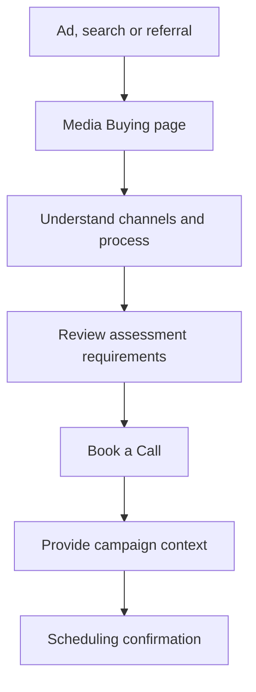

### Required decision information

Before booking, users should understand:

- Tieko’s professional fee is separate from advertising spend.
- Platforms and channels depend on the campaign objective.
- Performance cannot be guaranteed.
- Tracking readiness may need to be assessed.
- Creative production may be a separate or connected scope.

### Relevant internal links

- Content Creation
- Digital Presence Optimisation
- Billboard Advertising
- Relevant campaign case studies
- Media-buying insights

## 12. Compliance user flow

The compliance journey requires stricter boundaries.

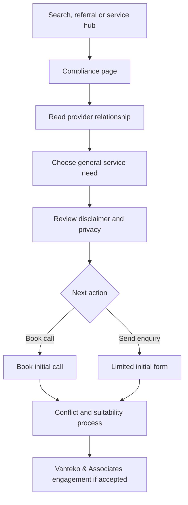

### Compliance-flow rules

- Tieko Media may receive a general initial request.
- The page must identify Vanteko & Associates as the provider of regulated legal services.
- The form must avoid detailed confidential narratives.
- Submission must not create a solicitor-client relationship.
- Conflict checks may precede substantive discussion.
- Data transfer must follow the approved privacy and professional workflow.
- The visitor must receive truthful next-step information.
- No page may promise approval, access or influence over regulators.

### Compliance internal links

- Legal Disclaimer
- Privacy
- Relevant compliance insights
- Intelligence Reports where regulatory research is relevant
- Book a Call

## 13. Digital Presence Optimisation flow

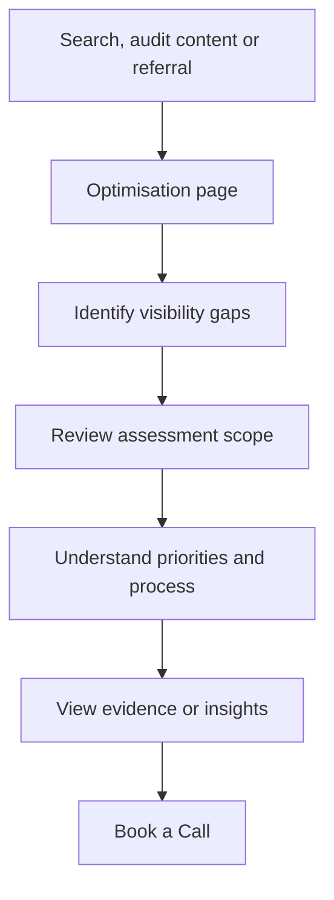

### Primary cross-links

- Media Buying
- Content Creation
- Relevant SEO and visibility insights
- Website or optimisation case studies
- Future digital-presence assessment

## 14. Content Creation flow

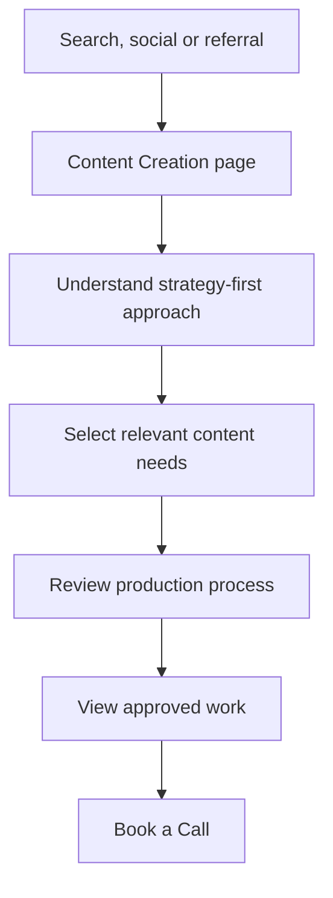

### Primary cross-links

- Media Buying
- Press Release Services
- Digital Presence Optimisation
- Work
- Content-system insights

## 15. Intelligence-report flow

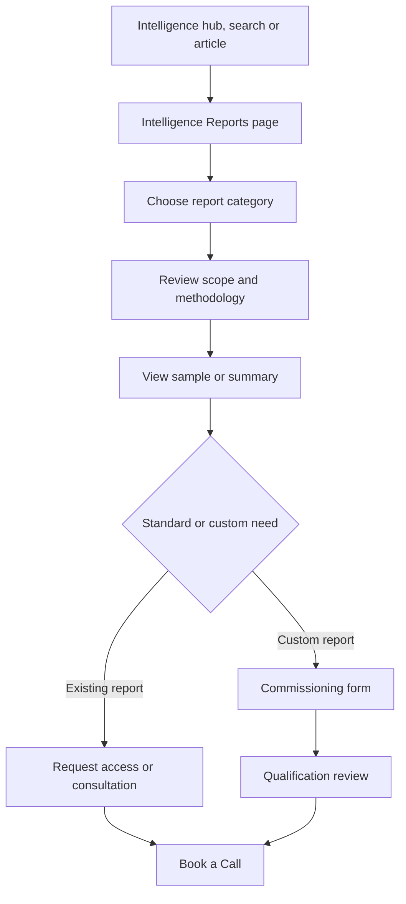

### Intelligence-flow rules

- Clearly identify reports as paid.
- Distinguish public summaries from paid content.
- Explain methodology and limitations.
- Preserve report category and source when the user begins an enquiry.
- Do not expose paid files through predictable public URLs.
- Do not promise a delivery date before scope confirmation.
- Do not introduce checkout until approved.

### Primary cross-links

- Intelligence hub
- Reports archive
- Relevant insights
- Compliance where regulatory analysis is required
- Digital Presence Optimisation where search intelligence is required
- Commission a Report
- Book a Call

## 16. Billboard Advertising flow

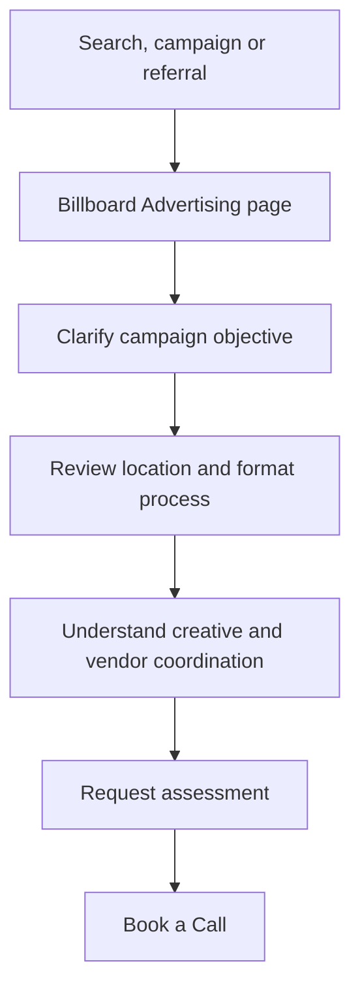

### Required decision information

Users should understand:

- Inventory is subject to confirmation.
- Vendor pricing and professional fees may be separate.
- Measurement differs from digital advertising.
- Creative adaptation may be required.
- Permits or third-party approvals may apply.
- Proof of placement should be defined in the engagement.

### Primary cross-links

- Media Buying
- Content Creation
- Press Release Services
- Relevant campaign work

## 17. Press Release Services flow

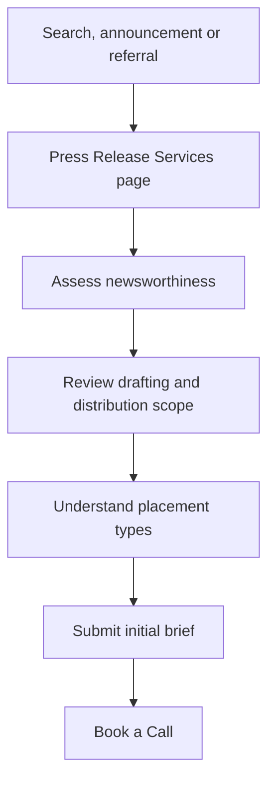

### Required decision information

The flow must distinguish:

- Earned media
- Sponsored placement
- Paid distribution
- Editorial review
- Tieko’s professional fees
- Third-party publication costs
- Monitoring and reporting

The page must state that publication and editorial acceptance cannot be guaranteed.

### Primary cross-links

- Content Creation
- Media Buying
- Digital Presence Optimisation
- Billboard Advertising
- Relevant PR work and insights

## 18. Products flow

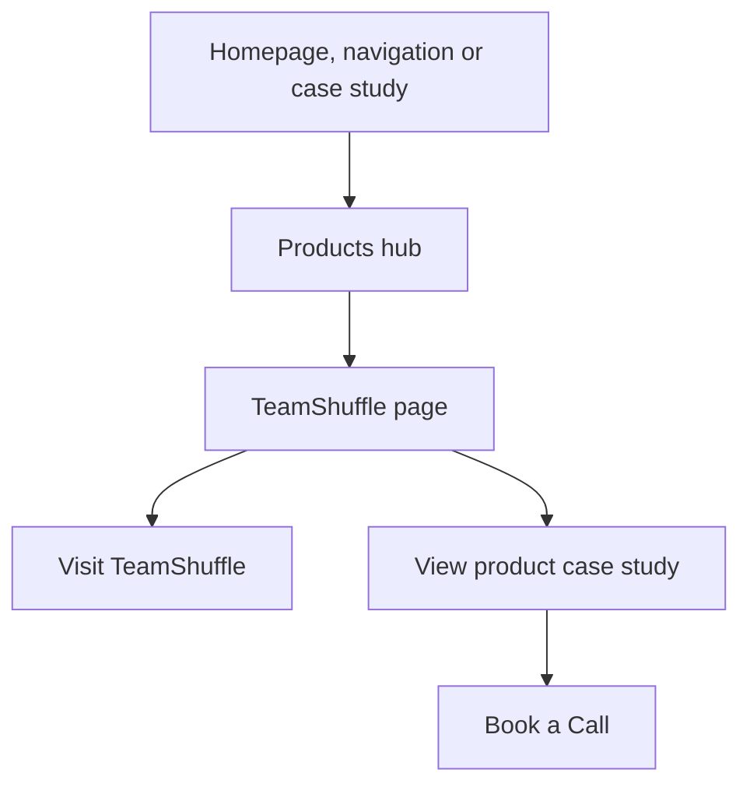

### Product-flow rules

- Approved live products should link to their own websites.
- External product links must be clearly identifiable.
- Product status must be accurate.
- Product pages should connect the product to Tieko’s capabilities.
- Confidential and unapproved products must not appear.
- Product pages must not become sales pages for unrelated services.

## 19. Work and case-study flow

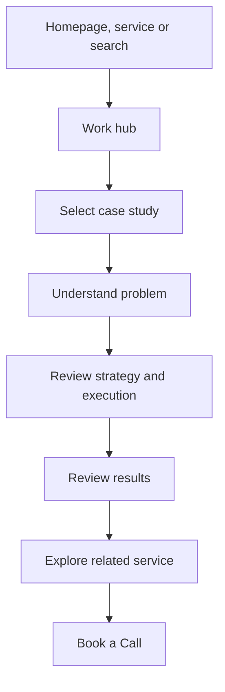

### Case-study linking rules

Each case study should link to:

- Relevant service pages
- Relevant product page where applicable
- Related insight
- Book a Call

Each service page should link back to the most relevant approved case studies.

## 20. Insights user flow

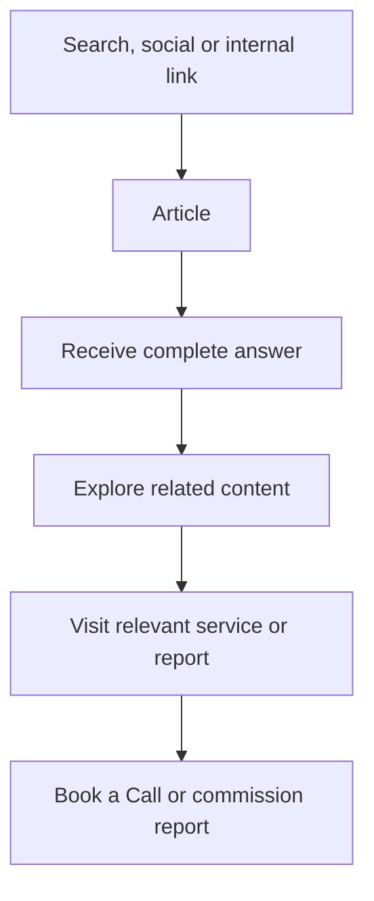

### Article conversion rules

- The article must answer the reader’s question before presenting a sales prompt.
- CTAs must match the topic.
- Internal links must be contextual.
- Articles should not contain aggressive repeated pop-ups.
- Author and update information must be visible.
- Sources should be supplied where required.
- Related content should be editorially relevant.

## 21. Book a Call flow

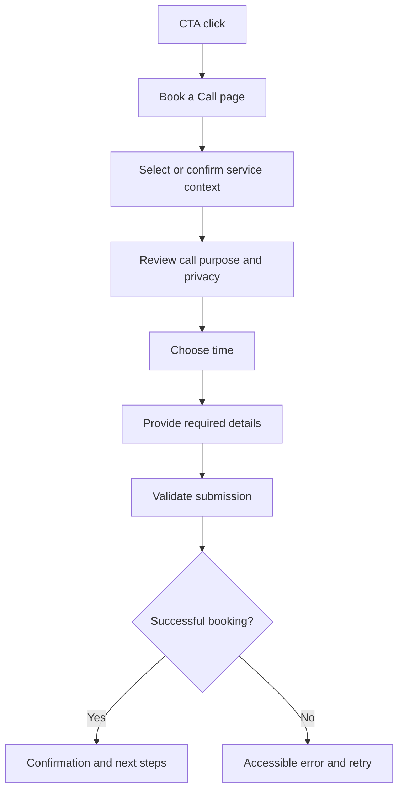

### Booking-flow requirements

- Preserve referral page and service context.
- Make timezone explicit.
- State the expected call duration.
- Explain what the visitor should prepare.
- Collect only necessary information.
- Display truthful confirmation.
- Provide calendar and rescheduling information where supported.
- Do not state or imply that booking creates a solicitor-client relationship.
- Record approved analytics events without collecting sensitive content.

## 22. General enquiry flow

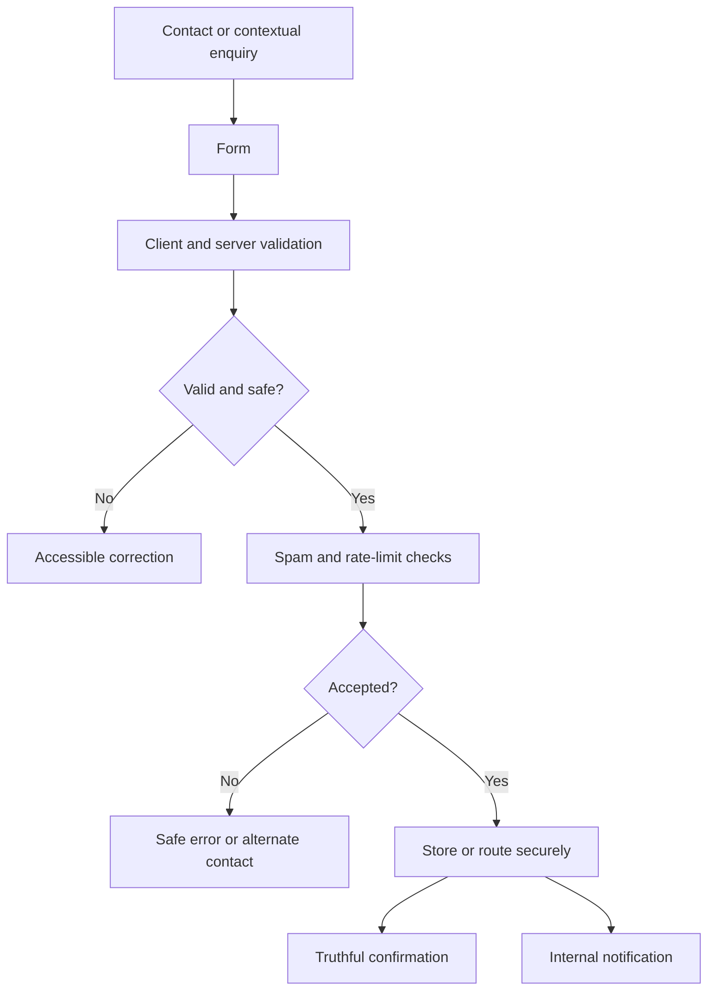

### Confirmation requirements

A successful confirmation must include:

- Confirmation that the message was received
- Submission reference where available
- Realistic next steps
- Alternative contact method if appropriate
- No guaranteed outcome
- No false claim that a human has reviewed the submission

## 23. Paid-campaign landing-page flow

Individual service pages may support focused advertising variants.

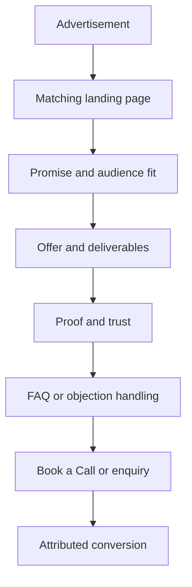

### Landing-page rules

- Message must match the advertisement.
- One primary conversion action should dominate.
- Global navigation may be simplified but not deceptive.
- Required legal and privacy links must remain accessible.
- Tracking parameters must be preserved securely.
- Pages must not become indexable duplicates of canonical service pages.
- Campaign claims must be verifiable.
- The experience must work without third-party tracking consent where possible.

## 24. Internal-linking system

### 24.1 Required link relationships

| Source | Must link to |
|---|---|
| Homepage | Major hubs, selected services, products, work, intelligence and insights |
| Services hub | All seven launch services |
| Service page | Related services, proof, insights, Book a Call |
| Product hub | All approved public products |
| Product page | Live product, related work, relevant capability |
| Intelligence hub | Reports, methodology, commissioning |
| Report page | Related reports, insights, Commission a Report |
| Work hub | Published case studies |
| Case study | Relevant services and Book a Call |
| Insights hub | Articles and topic archives where approved |
| Article | Related content, relevant service or report |
| About | Team, products, work and Book a Call |
| Footer | Priority hubs, services and legal pages |

### 24.2 Anchor-text principles

Internal links must:

- Describe the destination
- Avoid repetitive “click here” labels
- Remain natural in context
- Support users before search engines
- Avoid excessive exact-match repetition
- Never link confidential or unpublished content

### 24.3 Orphan-page prevention

No indexable page may be published without:

- At least one crawlable internal link from an appropriate hub or detail page
- Inclusion in the correct sitemap
- Correct canonical treatment
- A content owner
- A defined user purpose

## 25. Content discovery and taxonomy

### 25.1 Initial insight topics

- Digital Infrastructure
- Media Buying
- Search and Visibility
- Content Systems
- AI and Business
- Compliance
- Data and Analytics
- African Market Intelligence
- Product Building
- Reputation and Trust

### 25.2 Report categories

- Market Intelligence
- Competitor Intelligence
- Search and Demand Intelligence
- Regulatory Intelligence
- Digital Landscape Analysis
- Audience Research
- Opportunity Research
- Custom Commissioned Research

### 25.3 Case-study filters

Filters may include:

- Service
- Industry
- Location
- Project type

Filters should only be implemented when sufficient content exists. Empty or nearly empty filters should not appear at launch.

## 26. Search and filtering flow

Site search is optional for version 1.

If introduced:

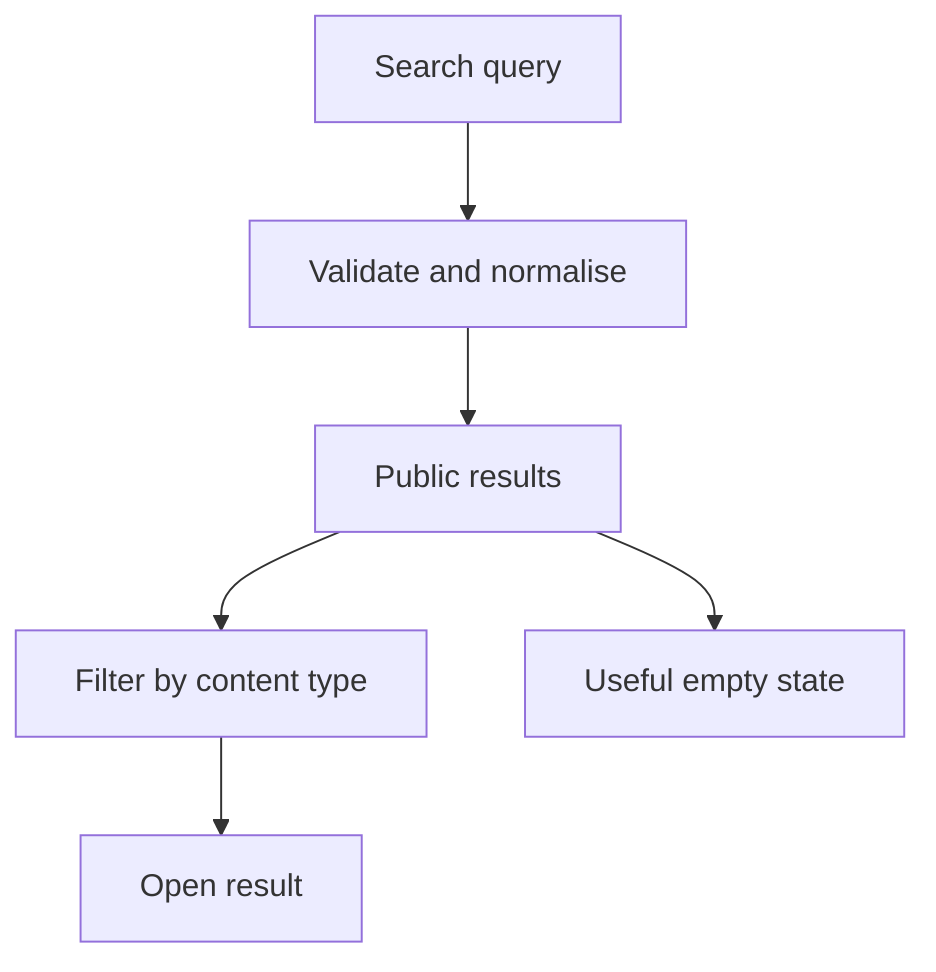

Search must exclude:

- Drafts
- Private reports
- Confidential product references
- Administrative content
- Personal enquiry data
- Preview URLs

## 27. Cross-device flow continuity

Users must be able to complete all primary flows on mobile without switching devices.

Required mobile behaviours:

- Book a Call remains discoverable.
- Forms use appropriate input types.
- Service comparison does not require wide tables.
- Àmì Ribbon assets are simplified and cropped safely.
- Long articles remain readable.
- Breadcrumbs do not cause horizontal overflow.
- The mobile menu exposes the same destinations as desktop.
- Embedded booking experiences remain usable or open through an accessible alternative.
- Tap-to-call and approved WhatsApp actions may be used where appropriate.

## 28. States and recovery flows

### 28.1 Loading states

Loading states must:

- Communicate progress
- Avoid content jumping
- Remain accessible
- Avoid indefinite animation
- Provide recovery if loading fails

### 28.2 Empty states

Required empty states may include:

- No reports in a selected category
- No case studies for a filter
- No search results
- No available booking slots

Each must explain what happened and provide a useful alternative.

### 28.3 Error states

Error messages must:

- Use plain language
- Avoid exposing technical details
- Identify correctable fields
- Preserve valid input where safe
- Provide a retry or alternative
- Be announced to assistive technology

### 28.4 Not-found page

The not-found experience must:

- State that the page could not be found
- Offer search or important navigation
- Link to Services, Insights and Book a Call
- Use a restrained brand expression
- Return the correct HTTP status

### 28.5 Submission failures

A failed submission must never display success.

The user should receive:

- A clear failure message
- Safe retry guidance
- An alternative contact route where appropriate
- No duplicate submission caused by uncontrolled retry

## 29. Analytics flow map

The following transitions must be measurable:

- Homepage to service
- Homepage to Book a Call
- Service to Book a Call
- Service to enquiry
- Article to service
- Article to report
- Report to Commission a Report
- Product page to external product
- Case study to related service
- Campaign page to conversion
- Form start to completion
- Booking start to completion where supported

Analytics must not capture:

- Detailed legal facts
- Form message content
- Uploaded document contents
- Sensitive personal data
- Authentication credentials

## 30. SEO flow requirements

Search engines should be able to move through the site using:

- Primary navigation
- Hub pages
- Breadcrumbs
- Contextual internal links
- HTML sitemap if later approved
- XML sitemap

The crawl path should prioritise:

1. Homepage
2. Commercial hubs
3. Priority services
4. Work and product proof
5. Intelligence and reports
6. Insights
7. Supporting legal and identity pages

Campaign duplicates, previews, drafts, internal search results and administrative routes must not enter the index.

## 31. Content-governance flow

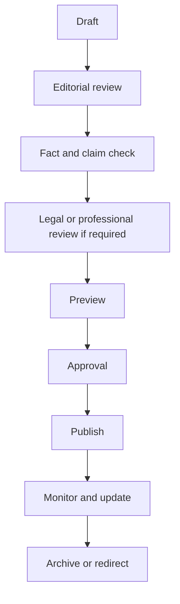

### Required review triggers

Legal or professional review is required when content includes:

- Legal advice or compliance interpretation
- Regulatory claims
- Data-protection guidance
- Professional credentials
- Comparative or potentially defamatory statements
- Client-sensitive information
- Guarantees or performance claims
- Intellectual-property claims

## 32. Navigation and architecture acceptance criteria

The architecture is ready for implementation when:

1. Every P0 page has a confirmed route and purpose.
2. Every priority service is accessible within one interaction from Services.
3. Book a Call is accessible from every major page.
4. Mobile and desktop navigation expose equivalent core destinations.
5. No confidential product appears in the sitemap.
6. Compliance flows preserve the Vanteko & Associates boundary.
7. Intelligence commissioning does not expose paid content.
8. Service pages have defined related links.
9. Articles can connect to commercial pages without becoming thin sales content.
10. Campaign landing pages have canonical and indexing rules.
11. Error and recovery paths are defined.
12. Breadcrumb rules are defined.
13. Orphan-page prevention rules are documented.
14. All primary flows can be completed on mobile.
15. Analytics transitions are defined without collecting sensitive content.
16. The architecture can support additional approved services without restructuring the whole platform.
17. Stakeholder approval is recorded.

## 33. Decisions required before UI design is finalised

The following decisions remain open:

- Whether the Services control uses a mega menu or a simpler grouped dropdown
- Final booking provider
- Whether booking is embedded or hosted externally
- Whether general enquiries and Book a Call remain separate
- Whether site search is included at launch
- Whether report previews require email submission
- Whether WhatsApp appears globally or only contextually
- Whether industry pages are needed at launch
- Final footer business identity information
- Final service grouping labels
- Approved case studies for launch
- Approved report samples
- Final public status of LegalFlashcards9ja

## 34. Immediate next steps

1. Review and approve this architecture.
2. Create the Brand and Design System document.
3. Create the SEO and Content Architecture document.
4. Resolve the open navigation and booking decisions.
5. Produce page-level wireframe requirements.
6. Create the Stitch master design prompt.
7. Create individual Stitch prompts beginning with the homepage.
8. Validate the designed flows on mobile, tablet and desktop before engineering.

## 35. Approval

**Product lead:** David Oluwadamilola Vanteko  
**Organisation:** Tieko Media Limited  
**Approval status:** Pending review
