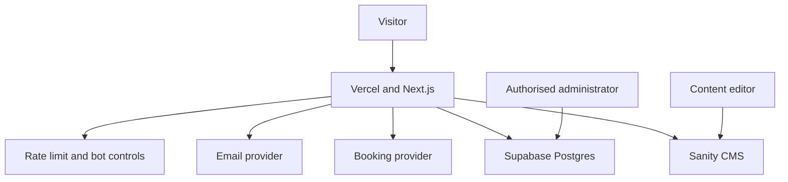
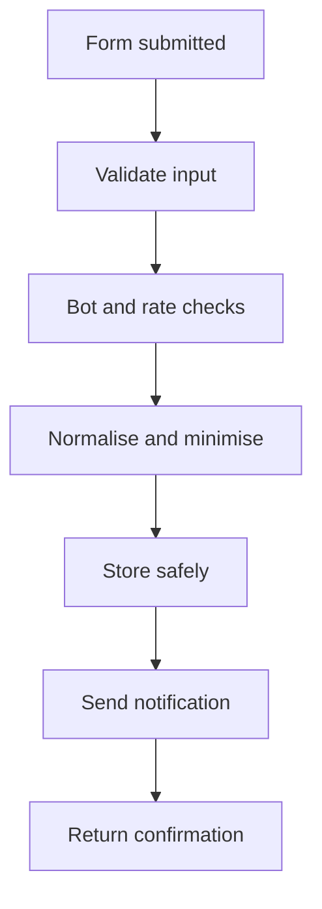

# Tieko Media Platform: Technical Design Document

**Document ID:** TMP-05  
**Version:** 0.1  
**Status:** Working draft  
**Date:** 16 September 2026  
**Owner:** Tieko Media Limited  
**Product lead:** David Oluwadamilola Vanteko  
**Parent documents:** TMP-00, TMP-01, TMP-02, TMP-03 and TMP-04  
**Repository:** tiekomedia-alt/tieko-media-platform

## 1. Purpose

This Technical Design Document defines how the Tieko Media website will be engineered, secured, deployed, operated and extended.

It converts the approved product, brand, architecture and SEO requirements into an implementation blueprint for Codex and human reviewers.

The document covers:

- Technology stack
- Application architecture
- Repository structure
- Rendering and caching
- Content management
- Operational data storage
- Forms and booking
- Digital Business Health Check
- Security and privacy
- SEO and structured data
- Accessibility
- Performance
- Testing
- Observability
- Deployment and recovery
- Technical governance

The separate Data and Backend Schema document will define detailed tables, fields, relationships, retention periods and access policies.

## 2. Engineering principles

1. Use the simplest architecture that satisfies the approved requirements.
2. Render important content on the server.
3. Send as little JavaScript to the browser as practical.
4. Separate public editorial content from sensitive operational data.
5. Validate every untrusted input at the server boundary.
6. Make secure behaviour the default.
7. Build reusable components without forcing every page into the same visual pattern.
8. Treat accessibility, SEO and performance as release requirements.
9. Keep service providers replaceable through documented interfaces.
10. Avoid speculative systems and premature complexity.
11. Never expose secrets, service-role keys or private data to the browser.
12. Keep public claims, structured data and displayed evidence synchronised.
13. Use British English in public content and avoid em dashes.
14. Maintain the distinctive Tieko identity without sacrificing usability.
15. Record material architectural decisions.

## 3. Scope

### 3.1 Version 1 includes

- Multi-page public website
- Eight service pages
- Services, Products, Intelligence, Work, Insights and About hubs
- Product pages
- Report pages and controlled report previews
- Case studies
- Articles
- Team profiles
- Book a Call
- General enquiry
- Contextual service enquiries
- Digital Business Health Check
- Optional result email
- Content administration
- SEO metadata and structured data
- Privacy-aware analytics
- Consent records
- Secure operational data storage
- Deployment, monitoring and backups

### 3.2 Version 1 does not include

- A client records-management portal
- Client document uploads for Data and Records Management
- A legal client portal
- Full ecommerce for intelligence reports
- A proprietary calendar system
- A general social network or user account system
- Automated legal advice
- Automated cybersecurity certification
- Public storage of confidential reports
- Mass-generated location or industry pages
- An unrestricted page builder

The Data and Records Management page is a professional service page. The website itself will not store client archives or accept sensitive client documents in version 1.

## 4. Recommended technology stack

| Layer | Recommended technology | Purpose |
|---|---|---|
| Web framework | Current supported stable Next.js App Router | Server rendering, routing, metadata, route handlers and caching |
| Language | TypeScript with strict mode | Type safety across the application |
| UI | React Server Components by default | Reduce client JavaScript and keep data access on the server |
| Styling | Tailwind CSS plus CSS custom properties and scoped CSS where needed | Token-driven responsive styling and precise brand implementation |
| Component foundation | Accessible headless primitives where justified | Menus, dialogs, accordions and focus management |
| CMS | Sanity | Pages, services, articles, reports, case studies, people, navigation and SEO content |
| Operational database | Supabase Postgres | Enquiries, bookings metadata, assessment results, consent and audit records |
| Validation | Zod or an equivalent TypeScript schema validator | Shared input and environment validation |
| Hosting | Vercel | Next.js deployment, previews, edge network and deployment controls |
| Media delivery | Sanity image pipeline for CMS assets | Responsive image transformations and delivery |
| Transactional email | Resend or approved equivalent | Enquiry and assessment notifications |
| Booking | Cal.com, Calendly or approved equivalent | Scheduling without building calendar infrastructure |
| Bot protection | Cloudflare Turnstile or approved equivalent | Human verification with server-side validation |
| Rate limiting | Managed Redis or platform-native durable rate limiting | Abuse prevention across distributed instances |
| Analytics | Plausible or GA4, subject to approval | Privacy-aware traffic and conversion measurement |
| Error monitoring | Sentry or approved equivalent | Application errors and performance diagnostics |
| Search monitoring | Google Search Console and Bing Webmaster Tools | Indexing and search performance |
| CI | GitHub Actions and Vercel checks | Automated quality gates |

### 4.1 Version policy

Do not hard-code this document to a framework version that may be obsolete when implementation begins.

At project creation:

- Select the current supported stable version.
- Record exact versions in package.json and the lockfile.
- Use Node.js active LTS supported by the selected framework.
- Commit the package-manager lockfile.
- Enable automated dependency alerts.
- Review major upgrades separately.
- Never accept an automated major upgrade directly into production.
- Run build, test, accessibility and security checks after dependency changes.

### 4.2 Package manager

Use pnpm unless an approved deployment constraint requires another package manager.

The repository must specify the package-manager version and Node.js version.

## 5. High-level architecture



### 5.1 Trust boundaries

- Browser input is always untrusted.
- CMS content is trusted only after schema validation and editorial approval.
- Webhooks are untrusted until signatures and replay protections are verified.
- Third-party booking and email responses must be validated.
- Supabase secret keys remain server-only.
- Sanity write tokens remain server-only.
- Public analytics must never receive sensitive form content.
- Administrative access must use strong authentication and least privilege.

## 6. Application architecture

### 6.1 Rendering model

Use Server Components for:

- Page shells
- Navigation
- Service pages
- Articles
- Reports
- Product pages
- Case studies
- Metadata
- CMS fetching
- Structured data
- Non-interactive content

Use Client Components only for:

- Mobile menu interaction
- Accessible dialogs
- Health Check answers and progress
- Form interaction
- Consent controls
- Approved motion
- Booking embed if required
- Interactive filters where justified

Client boundaries should be narrow. A whole page must not become a Client Component merely because one small element is interactive.

### 6.2 Data access layer

Create a server-only data access layer.

Responsibilities:

- Read public CMS content
- Read and write operational data
- Apply authorisation
- Validate returned shapes
- Redact sensitive fields
- Prevent direct use of privileged clients inside presentation components
- Centralise error handling and logging
- Make provider replacement possible

Server Actions and route handlers are public attack surfaces when reachable. Every action must enforce validation, authorisation where needed, rate limits and safe error responses.

### 6.3 Backend-for-frontend pattern

Next.js route handlers may act as a focused backend for the website.

Approved route groups may include:

- POST /api/enquiries
- POST /api/bookings/context
- POST /api/health-check/score
- POST /api/health-check/email
- POST /api/consent
- POST /api/webhooks/sanity
- POST /api/webhooks/booking
- GET /api/health where operationally appropriate

Do not expose generic database CRUD endpoints.

## 7. Proposed repository structure

```text
/
  app/
    (marketing)/
    services/
    products/
    intelligence/
    reports/
    work/
    insights/
    tools/
    about/
    team/
    contact/
    book-a-call/
    api/
    sitemap.ts
    robots.ts
    layout.tsx
  components/
    ui/
    navigation/
    content/
    forms/
    assessment/
    media/
    seo/
  features/
    enquiries/
    bookings/
    health-check/
    reports/
    consent/
  lib/
    cms/
    database/
    validation/
    security/
    analytics/
    email/
    booking/
    seo/
    logging/
  sanity/
    schemaTypes/
    structure/
    lib/
  styles/
  public/
  tests/
    unit/
    integration/
    accessibility/
    e2e/
  docs/
  scripts/
```

Route groups may be used to organise code without changing public URLs.

## 8. Design system implementation

### 8.1 Tokens

Define design tokens for:

- Colour
- Typography
- Font sizes
- Line heights
- Spacing
- Grid
- Borders
- Radius
- Shadows
- Motion
- Layering
- Content width
- Breakpoints

Tokens should be implemented with CSS custom properties and exposed to Tailwind where useful.

Do not scatter raw brand colour values throughout components.

### 8.2 Àmì Ribbon

The Àmì Ribbon should be implemented as a controlled visual component, not as a background applied indiscriminately.

Variants may include:

- Hero ribbon
- Section transition
- Image frame
- Flat editorial mark
- Mobile simplified mark
- Static fallback

Requirements:

- Prefer SVG or optimised raster assets.
- Avoid heavy canvas or WebGL for the primary experience.
- Keep decorative instances hidden from assistive technology.
- Respect prefers-reduced-motion.
- Prevent overlap with text and controls.
- Avoid cumulative layout shift.
- Load below-the-fold assets lazily.
- Supply art direction for mobile crops.
- Permit complete omission when it harms clarity or performance.

### 8.3 Anti-slop enforcement

Components must not default to:

- Gradient text
- Aurora backgrounds
- Neon glows
- Generic three-dimensional blobs
- Excessive rounded cards
- Pills for ordinary buttons or labels
- Animated borders
- Fake dashboards
- Unverified logo marquees
- Repeated fade-up animation
- Decorative stock avatars
- Repetitive CTA blocks

The visual system should use editorial composition, meaningful imagery, Tieko red, strong typography, technical lines and restrained texture.

## 9. Responsive implementation

Use content-driven breakpoints rather than designing for a fixed list of devices.

Minimum requirements:

- No horizontal scrolling at 320 CSS pixels.
- Full functionality at 200 per cent zoom.
- Touch targets should normally be at least 44 by 44 CSS pixels.
- Body text must remain readable without zoom.
- Service grids must collapse without changing reading order.
- Tables must reflow, scroll with labels or become stacked comparisons.
- Sticky navigation must remain stable.
- Booking and Health Check flows must work on mobile.
- The Àmì Ribbon must use mobile-specific composition.
- Navigation content must remain equivalent across screen sizes.

## 10. Navigation architecture

The header remains available on all public pages.

Implementation requirements:

- Use semantic nav and links.
- Use CSS sticky positioning where practical.
- Reserve header height to avoid layout shift.
- Provide a visible current-page state.
- Provide keyboard-operable desktop menus.
- Use a properly labelled mobile menu button.
- Trap focus only when the mobile panel behaves as a modal.
- Close using the close control, Escape and successful navigation.
- Restore focus to the trigger.
- Prevent background scrolling while a modal menu is open.
- Keep Book a Call prominent without using multiple competing buttons.

The service menu must accommodate eight services without overcrowding.

## 11. Content management system

### 11.1 Sanity responsibilities

Sanity will manage public editorial content:

- Global settings
- Navigation
- Footer
- Services
- Products
- Intelligence pages
- Reports and previews
- Case studies
- Articles
- Authors
- Reviewers
- Team profiles
- Landing-page content
- FAQs
- Calls to action
- Redirect records
- SEO fields
- Social images
- Approved Google rating display fields
- Legal and policy content

Sanity must not store:

- General enquiry submissions
- Detailed compliance matters
- Assessment answers tied to individuals
- Booking payloads
- Consent evidence
- Operational audit logs
- Sensitive client records
- Paid report source files unless a separate protected delivery design is approved

### 11.2 Content workflow

Recommended content states:

1. Draft
2. Editorial review
3. Fact review
4. Professional review where required
5. Approved
6. Published
7. Scheduled for review
8. Archived

Sanity roles should reflect real responsibilities. Publishing authority must be limited.

### 11.3 Controlled modular pages

The page builder must use an allowlist of approved sections.

Examples:

- Editorial hero
- Service introduction
- Audience block
- Problem and outcome block
- Process
- Deliverables
- Proof
- Case-study feature
- Report feature
- Related insights
- FAQ
- Conversion section
- Rich text
- Media block
- Quote with verified attribution

Editors may reorder permitted sections, but cannot inject arbitrary scripts, raw HTML or unsafe embeds.

### 11.4 Preview and revalidation

- Draft preview requires authenticated access.
- Preview URLs must not be indexable.
- Sanity webhooks should trigger targeted cache revalidation.
- Webhook signatures or secrets must be verified.
- Revalidation should identify the affected route, not purge the whole site unnecessarily.
- Publishing errors must be visible to editors without exposing secrets.

## 12. Operational database

Supabase Postgres will hold structured operational data.

Initial domains:

- Enquiries
- Enquiry routing
- Assessment sessions
- Assessment responses
- Assessment scores
- Email delivery requests
- Consent records
- Booking references
- Campaign attribution
- Idempotency records
- Abuse and rate-limit signals where appropriate
- Administrative audit events
- Data deletion requests
- Retention jobs

Detailed schema belongs in TMP-06.

### 12.1 Database rules

- Deny public table access by default.
- Enable Row Level Security on exposed Supabase tables.
- Prefer server-only writes for public forms.
- Never expose the service-role key.
- Use a restricted database role for the application.
- Use parameterised queries through an approved client.
- Apply database constraints in addition to application validation.
- Create indexes from observed query needs.
- Keep migrations in version control.
- Do not edit production schema manually without a recorded migration.
- Separate production and non-production projects.
- Do not copy production personal data into development.

## 13. Forms and enquiry handling

### 13.1 Standard processing flow



### 13.2 Validation

Every form must use:

- Client-side validation for usability
- Server-side schema validation for security
- Field allowlists
- Type checks
- Maximum lengths
- Normalisation
- Enumerated values where possible
- Safe text handling
- Unknown-field rejection or removal
- Consistent error objects

Do not accept HTML in ordinary text fields.

### 13.3 Injection protection

- Use parameterised database operations.
- Never concatenate untrusted input into SQL.
- Escape output according to its destination.
- Do not pass form text into shell commands.
- Do not allow user-controlled template execution.
- Do not build redirect URLs directly from input.
- Do not place form messages in analytics.
- Treat email headers separately from email bodies.
- Prevent carriage-return and newline injection in email metadata.
- Maintain a strict Content Security Policy.

### 13.4 Spam and abuse

Use layered controls:

- Honeypot
- Submission timing signal
- Server-side Turnstile verification where enabled
- IP and identifier-based rate limits
- Payload-size limits
- Duplicate and replay protection
- Idempotency keys where appropriate
- Generic external error messages
- Internal abuse logging without excessive personal data

Blocking decisions must not rely on a single easily manipulated client signal.

### 13.5 Compliance enquiries

Compliance forms must:

- Request only high-level service context.
- Warn users not to submit detailed confidential facts.
- Avoid file upload.
- State that submission does not create a solicitor-client relationship.
- Explain that conflict and suitability checks may be required.
- Route regulated legal work to the approved Vanteko & Associates workflow.
- Record the entity receiving the enquiry.
- Avoid analytics capture of the message.

### 13.6 Data and Records Management enquiries

The service form must:

- Ask about the organisation type, approximate record volume, format and general objective.
- Avoid accepting actual records or samples.
- Warn users not to submit confidential documents.
- Ask whether records contain personal, legal, health, financial or other sensitive information using categories, not details.
- Record whether physical storage, scanning, hosting or destruction may be needed.
- Explain that specialist partners may be introduced after scope and due diligence.
- Avoid promising absolute protection from data leakage.

## 14. File upload policy

Public file uploads are out of scope for version 1.

If a future feature requires uploads, it must not be enabled until a separate threat model and design approval cover:

- Business necessity
- Authentication
- Extension allowlist
- File-signature inspection
- Content-Type distrust
- File-size and count limits
- Generated storage names
- Private storage
- Malware scanning
- Quarantine
- Safe document rendering
- Metadata removal
- Access control
- Expiry and deletion
- Audit logging
- Incident response

Uploaded files must never be stored in an executable public directory.

## 15. Digital Business Health Check

### 15.1 Architecture

The free assessment should use a versioned question set.

- Questions and public explanations may be managed in Sanity.
- Scoring weights and sensitive business rules should remain server-side.
- The browser may hold temporary progress for recovery.
- Final scores should be calculated or verified on the server.
- The user should receive the basic result immediately.
- Email is optional.
- Marketing consent is separate.
- Results must not be treated as certification.

### 15.2 Data minimisation

Before optional email delivery:

- Do not require a name.
- Do not require an email.
- Do not ask for sensitive legal, security or financial facts.
- Do not send individual answers to analytics.
- Prefer an anonymous short-lived assessment identifier.
- Store only what is necessary for aggregate improvement if approved.

For email delivery:

- Validate the email.
- Record the exact consent text and version.
- Store marketing consent separately from delivery permission.
- Explain retention.
- Provide deletion and unsubscribe pathways where applicable.

### 15.3 Scoring integrity

- Version every question set and scoring model.
- Store the scoring version with the result.
- Reject missing, duplicated or unknown question identifiers.
- Enforce answer ranges.
- Prevent negative or out-of-range scores.
- Do not trust a score supplied by the browser.
- Use deterministic tests for every band boundary.
- Do not expose internal weighting if it creates manipulation risk.
- Never describe a high score as legal compliance or security certification.

## 16. Booking integration

Preferred approach:

1. Use a reputable booking provider.
2. Pass only safe service context and campaign attribution.
3. Use a hosted booking page if an embed harms accessibility or performance.
4. Verify webhooks before recording booking status.
5. Keep booking credentials server-only.
6. Provide a manual contact alternative.
7. Make timezone and duration clear.
8. Do not claim success until the provider confirms the booking.

The database may store a provider reference, service context, status and timestamps. It should not duplicate unnecessary calendar data.

## 17. Email and notifications

Transactional messages may include:

- Enquiry receipt
- Internal enquiry notification
- Health Check result delivery
- Booking-related message where not handled by the provider
- Report commissioning acknowledgement

Requirements:

- Use a verified Tieko domain.
- Configure SPF, DKIM and DMARC.
- Separate transactional delivery from marketing.
- Avoid sensitive message content in subject lines.
- Escape user-provided content.
- Do not expose internal recipients.
- Use retry controls and idempotency.
- Log provider identifiers and delivery state, not full message bodies where unnecessary.
- Never state that a human has reviewed a submission when only an automated acknowledgement occurred.

## 18. Authentication and administration

Public visitors do not need accounts for version 1.

Administrative access should be divided:

- CMS editors use Sanity authentication and roles.
- Operational administrators use Supabase or a protected internal interface only if required.
- Deployment access uses GitHub and Vercel roles.
- Provider dashboards use named accounts, not shared credentials.

Requirements:

- Multi-factor authentication for privileged users
- Least privilege
- Named accounts
- Prompt removal of former team members
- Secure recovery procedures
- Periodic access review
- Audit logging for sensitive administrative actions
- No production credentials in screenshots, tickets or source control

Do not build a custom admin dashboard in version 1 unless a real operational need cannot be met safely by approved provider interfaces.

## 19. Security architecture

### 19.1 Security headers

Configure and test:

- Content-Security-Policy
- Strict-Transport-Security
- X-Content-Type-Options
- Referrer-Policy
- Permissions-Policy
- Frame protection through CSP frame-ancestors
- Secure cookie attributes

CSP should start in report-only mode during integration, then move to enforcement after legitimate sources are enumerated.

### 19.2 Secrets

- Use deployment secret storage.
- Separate development, preview and production secrets.
- Never prefix private secrets with browser-exposed environment conventions.
- Validate required environment variables at startup or build time.
- Rotate compromised credentials.
- Limit token scopes.
- Document secret ownership and rotation.

### 19.3 Supply-chain security

- Enable Dependabot or equivalent alerts.
- Run dependency review on pull requests.
- Avoid abandoned libraries.
- Minimise packages.
- Pin the lockfile.
- Run static analysis.
- Protect the main branch.
- Require review and passing checks.
- Generate an inventory of production dependencies.
- Review third-party scripts before addition.

### 19.4 Threat areas

The threat model must cover:

- SQL injection
- Cross-site scripting
- Cross-site request forgery
- Server-side request forgery where URL fetching exists
- Open redirects
- Spam
- Bot abuse
- Denial of service
- Credential theft
- Broken access control
- Webhook forgery
- Data over-collection
- Accidental analytics leakage
- CMS account compromise
- Malicious rich content
- Dependency compromise
- Cache poisoning
- Business-logic manipulation of assessment scores

### 19.5 Privacy and retention

- Collect the minimum data.
- Define purpose before collection.
- Record consent where relied upon.
- Apply retention schedules.
- Delete or anonymise expired data.
- Provide data-subject request workflows.
- Document processors and cross-border transfers.
- Do not use enquiry content to train models without explicit lawful approval.
- Do not place sensitive personal data into prompts or external AI systems.

## 20. SEO engineering

Implement:

- Next.js metadata API or equivalent
- Canonical URLs
- Robots directives
- XML sitemaps
- Dynamic social metadata
- Breadcrumbs
- Crawlable links
- Redirect registry
- Structured data components
- Correct status codes
- Consistent trailing-slash policy
- Lowercase stable URLs
- Draft and preview noindex
- Campaign duplicate canonicalisation
- Image metadata
- Author and reviewer relationships

Structured data must be generated from validated page data and must match visible content.

Do not add self-serving organisation review markup for Tieko's Google rating.

## 21. Content security and rich text

Rich text rendering must:

- Use an allowlist of approved components.
- Reject arbitrary script and iframe insertion.
- Restrict external embeds.
- Add safe link attributes based on destination.
- Prevent javascript and unsafe data URLs.
- Preserve heading hierarchy.
- Require alternative text for informative images.
- Mark decorative images correctly.
- Avoid raw HTML rendering unless sanitised and approved.

## 22. Accessibility engineering

Target WCAG 2.2 Level AA.

Required practices:

- Semantic landmarks
- Logical heading hierarchy
- Keyboard access
- Visible focus
- Skip link
- Accessible names
- Form labels and descriptions
- Programmatic error association
- Error summary for complex forms
- Live-region announcements for assessment progress and results where appropriate
- Reduced-motion support
- Sufficient colour contrast
- Zoom and reflow support
- Captions and transcripts
- No essential information conveyed by colour alone
- No keyboard traps
- Accessible route-change behaviour
- Correct language declaration

Automated testing is necessary but not sufficient. Manual keyboard and screen-reader checks are required.

## 23. Performance architecture

### 23.1 Initial performance budgets

At the 75th percentile for mobile field data, target:

- Largest Contentful Paint at or below 2.5 seconds
- Interaction to Next Paint at or below 200 milliseconds
- Cumulative Layout Shift at or below 0.1

Initial implementation budgets:

- Minimise client JavaScript on editorial pages
- No autoplay background video in the primary mobile hero
- Self-host or efficiently serve approved fonts
- Limit font families, weights and subsets
- Use responsive images
- Reserve media dimensions
- Lazy-load below-the-fold media
- Defer non-essential third-party scripts
- Avoid heavy animation libraries unless measured and justified

The exact JavaScript and image budgets should be established after the first representative homepage and service-page builds.

### 23.2 Caching

- Cache public CMS reads appropriately.
- Use targeted on-demand revalidation after publishing.
- Do not cache personalised or sensitive form responses publicly.
- Do not allow shared caches to mix user-specific results.
- Define stale behaviour for CMS outages.
- Preserve the ability to publish urgent legal or factual corrections.

## 24. Analytics and consent

Track events such as:

- service_view
- book_call_click
- booking_start
- booking_complete
- enquiry_start
- enquiry_submit
- health_check_start
- health_check_complete
- report_view
- report_enquiry
- product_external_visit
- article_to_service
- case_study_to_service

Event payloads may include:

- Page type
- Service identifier
- Report identifier
- Referrer class
- Campaign parameters after validation
- Device class where provided by the analytics platform
- Consent state

Event payloads must not include:

- Form message
- Legal facts
- Assessment answer text
- Email address
- Telephone number
- Uploaded content
- Booking notes
- Full IP address stored by Tieko unless strictly required and documented

Consent behaviour must match the selected analytics and advertising tools.

## 25. Observability

### 25.1 Logging

Use structured logs with:

- Timestamp
- Environment
- Request or correlation identifier
- Route or operation
- Outcome
- Safe error code
- Duration
- Provider reference where safe

Do not log secrets, full form messages, tokens or sensitive personal data.

### 25.2 Error monitoring

Monitor:

- Server errors
- Client errors
- Failed form submissions
- Email failures
- Booking webhook failures
- CMS webhook failures
- Assessment scoring failures
- Database connectivity
- Slow routes
- Security-control failures

Alerts must have an owner and response procedure.

### 25.3 Availability checks

Monitor:

- Homepage
- A representative service page
- Book a Call
- Health Check start
- Form API health using a non-submitting or safe synthetic path
- CMS and database dependencies where supported

## 26. Testing strategy

### 26.1 Unit tests

Cover:

- Validation schemas
- Scoring rules
- Readiness bands
- Metadata builders
- Structured-data builders
- Redirect validation
- Consent logic
- Data redaction
- Utility functions

### 26.2 Integration tests

Cover:

- CMS query mapping
- Database writes
- Rate-limit behaviour
- Bot verification
- Email provider adapter
- Booking webhook verification
- Sanity webhook revalidation
- Error handling
- Idempotency

### 26.3 End-to-end tests

Cover:

- Navigation on desktop and mobile
- Every primary service route
- Book a Call
- General enquiry
- Compliance enquiry warnings
- Data and Records Management enquiry warnings
- Health Check completion
- Optional result email
- Article internal links
- Report enquiry
- 404 recovery
- Cookie and consent controls

### 26.4 Security tests

Include:

- Invalid and oversized payloads
- Unknown fields
- Script input
- SQL injection strings
- Header injection attempts
- Repeated submissions
- Forged webhook requests
- Open redirect attempts
- Direct access to protected previews
- Service-role key exposure scan
- Dependency audit
- CSP validation

### 26.5 Accessibility tests

Use automated rules plus:

- Keyboard-only review
- Screen-reader review
- Zoom and reflow review
- Reduced-motion review
- Colour contrast review
- Form error review
- Mobile menu focus review

### 26.6 Visual regression

Capture representative widths for:

- Homepage
- Service page
- Article
- Report
- Health Check
- Book a Call
- Mobile navigation
- Error states

Visual tests should detect unintended changes without treating every intentional responsive difference as failure.

## 27. Continuous integration

Every pull request should run:

1. Install from lockfile
2. Type check
3. Lint
4. Unit tests
5. Integration tests that do not require production data
6. Production build
7. Accessibility smoke tests
8. Broken-link and route checks
9. Secret scan
10. Dependency review
11. Preview deployment
12. Lighthouse or equivalent performance sampling on representative pages

The main branch must be protected. Direct production changes should be exceptional and recorded.

## 28. Environments

Use separate environments:

| Environment | Purpose | Data |
|---|---|---|
| Local | Development | Synthetic |
| Preview | Pull-request review | Synthetic or isolated test data |
| Staging | Release validation where needed | Non-production |
| Production | Public service | Production data |

Requirements:

- Separate CMS datasets or strict preview rules.
- Separate Supabase projects for production and non-production.
- Separate provider keys.
- No production email delivery from local development.
- Visible non-production indicators.
- Non-production noindex.
- Production data must not be downloaded into developer machines without authorised necessity and controls.

## 29. Deployment

Recommended flow:

1. Create feature branch.
2. Open pull request.
3. Run automated checks.
4. Generate preview deployment.
5. Conduct design, content and functional review.
6. Obtain required approvals.
7. Merge to protected main branch.
8. Deploy production.
9. Run smoke tests.
10. Monitor errors and conversions.
11. Roll back if release criteria fail.

Database migrations must be backward-compatible where possible and applied through an approved migration workflow.

## 30. Backup and recovery

### 30.1 Content

- Confirm Sanity dataset backup or export procedures.
- Schedule exports according to the selected plan and business need.
- Store exports securely.
- Test restoration.

### 30.2 Operational database

- Enable the appropriate Supabase backup capability.
- Document recovery point and recovery time objectives.
- Remember that database backups and object storage may have different recovery behaviour.
- Export critical configuration and policies.
- Test restoration in a non-production environment.

### 30.3 Source and configuration

- GitHub is the source of truth for code and migrations.
- Document DNS, domain and provider configuration.
- Keep infrastructure ownership information current.
- Store recovery codes securely outside ordinary source control.

## 31. Incident response

Define severity levels and contacts for:

- Website outage
- Form failure
- Data exposure
- Account compromise
- Malicious content publication
- Dependency vulnerability
- Domain or DNS issue
- Incorrect legal or compliance content
- Paid report exposure
- Assessment scoring defect

Minimum process:

1. Detect and record.
2. Contain.
3. Preserve necessary evidence.
4. Assess affected data and users.
5. Notify responsible leadership and advisers.
6. Remediate.
7. Communicate where legally or ethically required.
8. Review root cause.
9. Add preventive controls.

## 32. Data and Records Management service boundary

Tieko's public website must accurately present this service without pretending that the marketing platform itself is the client delivery system.

The service may cover:

- Retention schedules
- Digitisation
- Document imaging
- Classification
- Indexing
- Metadata
- Archiving
- Storage coordination
- Access procedures
- Data discovery
- Compliance readiness
- Secure destruction coordination
- Information governance
- Workflow optimisation

Technical and contractual scoping must identify:

- Data owner
- Data controller and processor roles
- Authorised users
- Record categories
- Sensitivity
- Storage location
- Encryption expectations
- Access controls
- Retention
- Destruction
- Subprocessors
- Incident responsibilities
- Cross-border transfers
- Backup and recovery
- Exit and data-return arrangements

The website must not claim absolute prevention of data leakage. It may state that Tieko helps reduce leakage risk through governance, controlled handling, appropriate systems and approved specialist partners.

## 33. Architectural decisions

The following decisions are recommended:

| Decision | Recommendation | Reason |
|---|---|---|
| Frontend | Next.js App Router with TypeScript | Strong server rendering, metadata and deployment ecosystem |
| Public content | Sanity | Structured editorial workflow and flexible content modelling |
| Operational data | Supabase Postgres | Relational integrity, policies, backups and future extensibility |
| Public accounts | None for version 1 | Avoid unnecessary authentication and personal data |
| File uploads | Disabled for public version 1 | Reduce risk and avoid confidential-document collection |
| Admin dashboard | Use provider interfaces initially | Avoid premature custom administration |
| Health Check score | Server-verified | Prevent manipulation and preserve versioned rules |
| Hosting | Vercel initially | Direct Next.js support and previews |
| Booking | Third-party provider | Avoid building complex calendar infrastructure |
| Page building | Controlled section allowlist | Preserve quality, security and brand consistency |

## 34. Open decisions

Before implementation begins, approve:

- Final domain and canonical host
- Sanity plan and project ownership
- Supabase region and plan
- Vercel team ownership
- Booking provider
- Transactional email provider
- Analytics platform
- Consent management method
- Bot-protection provider
- Rate-limit provider
- Error-monitoring provider
- Production notification recipients
- Data-retention periods
- Public telephone and email
- Google Business Profile URL and review count
- Whether report samples are gated
- Whether WhatsApp is a conversion route
- Whether staging is separate from preview deployments
- Launch languages
- Primary deployment region and data-transfer assessment

## 35. Implementation phases

### Phase A: Foundation

- Initialise Next.js and TypeScript
- Configure linting, formatting and tests
- Establish design tokens
- Create repository structure
- Configure environments
- Add CI
- Create base layout and sticky navigation

### Phase B: Content platform

- Configure Sanity
- Build schemas
- Create preview
- Create query layer
- Build metadata and structured-data utilities
- Create page sections
- Create redirects and sitemap

### Phase C: Core public pages

- Homepage
- Services hub
- Eight service pages
- Products
- Intelligence
- Work
- Insights
- About
- Contact
- Book a Call
- Legal pages

### Phase D: Operational features

- Supabase schema
- General enquiry
- Service enquiries
- Consent records
- Email notifications
- Rate limits
- Bot controls
- Booking context and webhooks

### Phase E: Health Check

- Question model
- Scoring service
- Results
- Optional email
- Paid-audit conversion
- Analytics without answer leakage

### Phase F: Quality and launch

- Content migration
- Responsive QA
- Accessibility review
- Security testing
- SEO validation
- Performance optimisation
- Observability
- Backup test
- Deployment
- Post-launch monitoring

## 36. Definition of done

The technical platform is ready for launch when:

1. Every required route is implemented.
2. The eight service pages use approved content.
3. Content editors can safely manage approved content types.
4. Sensitive operational data is not stored in the CMS.
5. Forms use server-side validation, rate limits and bot controls.
6. No public file uploads are enabled.
7. Compliance and Data and Records Management forms warn against sending confidential documents.
8. The Health Check score is server-verified and versioned.
9. Consent is separate and recorded.
10. Structured data matches visible content.
11. Preview and non-production pages are not indexable.
12. Core Web Vitals targets are met or documented issues have approved remediation.
13. WCAG 2.2 Level AA checks are completed.
14. Security headers are enforced.
15. Secrets are not exposed.
16. Automated tests and production build pass.
17. Monitoring and alerts are operational.
18. Backup and recovery procedures are documented and tested.
19. Redirects from the legacy website are approved.
20. Launch smoke tests pass.
21. Ownership for every provider and operational process is recorded.
22. Stakeholder approval is recorded.

## 37. Reference standards and guidance

Implementation should follow current official guidance, including:

- [Next.js data security](https://nextjs.org/docs/app/guides/data-security)
- [Next.js Content Security Policy](https://nextjs.org/docs/app/guides/content-security-policy)
- [Next.js Server and Client Components](https://nextjs.org/docs/app/getting-started/server-and-client-components)
- [Next.js backend-for-frontend guidance](https://nextjs.org/docs/app/guides/backend-for-frontend)
- [Sanity and Next.js integration](https://www.sanity.io/docs/nextjs)
- [Sanity GROQ-powered webhooks](https://www.sanity.io/docs/content-lake/webhooks)
- [Supabase database guidance](https://supabase.com/docs/guides/database/overview)
- [Supabase API key guidance](https://supabase.com/docs/guides/getting-started/api-keys)
- [Supabase storage guidance](https://supabase.com/docs/guides/storage)
- [Supabase database backups](https://supabase.com/docs/guides/platform/backups)
- [OWASP Input Validation Cheat Sheet](https://cheatsheetseries.owasp.org/cheatsheets/Input_Validation_Cheat_Sheet.html)
- [OWASP File Upload Cheat Sheet](https://cheatsheetseries.owasp.org/cheatsheets/File_Upload_Cheat_Sheet.html)
- [OWASP Node.js Security Cheat Sheet](https://cheatsheetseries.owasp.org/cheatsheets/Nodejs_Security_Cheat_Sheet.html)
- [OWASP CSRF Prevention Cheat Sheet](https://cheatsheetseries.owasp.org/cheatsheets/Cross-Site_Request_Forgery_Prevention_Cheat_Sheet.html)
- [OWASP Business Logic Security Cheat Sheet](https://cheatsheetseries.owasp.org/cheatsheets/Business_Logic_Security_Cheat_Sheet.html)

## 38. Immediate next steps

1. Review and approve the recommended stack.
2. Create TMP-06 Data and Backend Schema.
3. Decide the open provider choices before implementation.
4. Create the page-level content brief template and first briefs.
5. Create the Stitch master prompt from the approved content hierarchy and design system.
6. Prepare the initial repository scaffold only after the TDD and schema are approved.
7. Create an architectural decision record for any material deviation.

## 39. Approval

**Product lead:** David Oluwadamilola Vanteko  
**Organisation:** Tieko Media Limited  
**Approval status:** Pending review
