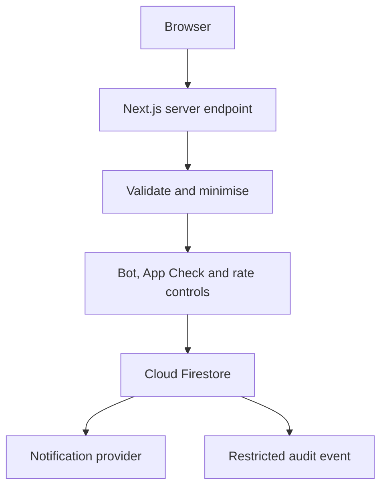
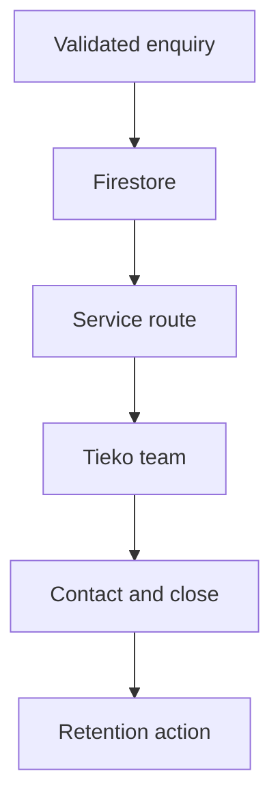
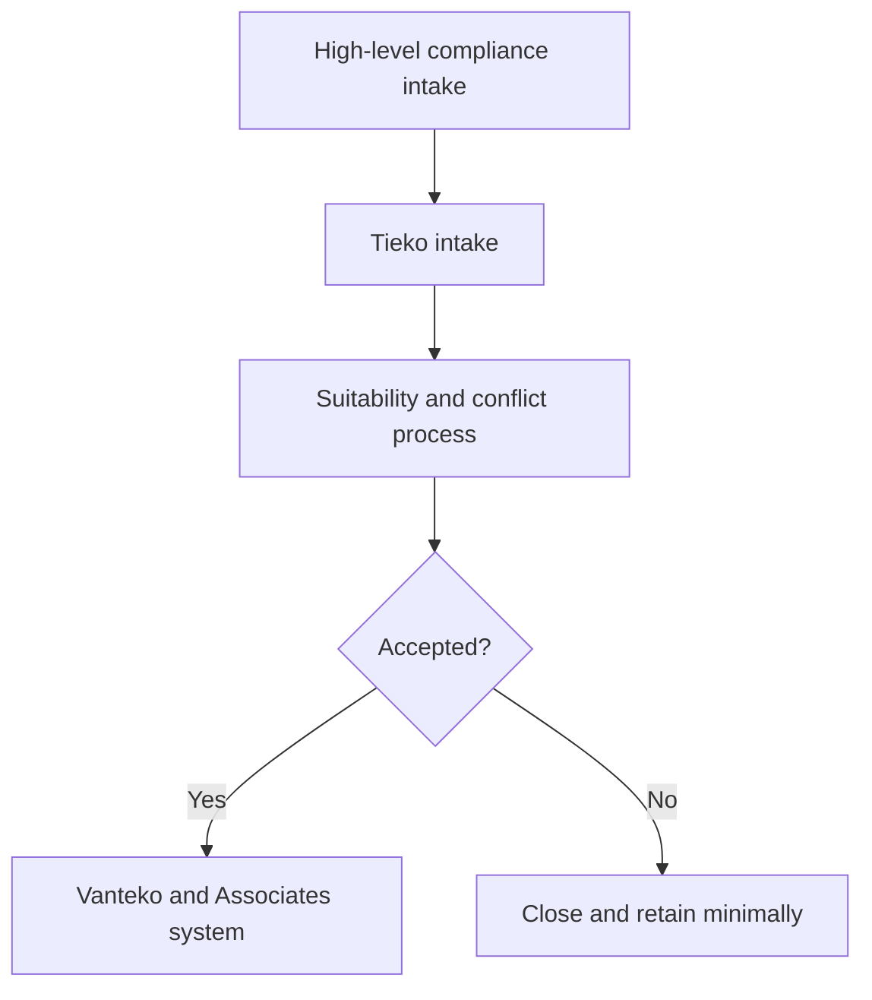

# Tieko Media Platform: Data and Backend Schema

**Document ID:** TMP-06  
**Version:** 0.1  
**Status:** Working draft  
**Date:** 16 September 2026  
**Owner:** Tieko Media Limited  
**Product lead:** David Oluwadamilola Vanteko  
**Parent documents:** TMP-00 to TMP-05  
**Repository:** tiekomedia-alt/tieko-media-platform

## 1. Purpose

This document defines the data architecture for the Tieko Media website using Firebase and Cloud Firestore.

It establishes:

- Data ownership and classification
- Firestore collections and document shapes
- Public submission boundaries
- Health Check storage
- Consent evidence
- Compliance and records-management safeguards
- Authentication and authorisation
- Security Rules strategy
- Indexes and query patterns
- Retention, deletion and anonymisation
- Audit events
- Backup and recovery requirements
- Cost-efficient access patterns
- Schema validation and migration rules

This is a logical schema. Exact TypeScript types, validation schemas, Firestore converters, Security Rules and indexes will be implemented from this document.

## 2. Data architecture principles

1. Collect only data required for a defined purpose.
2. Separate public content from operational data.
3. Separate anonymous assessment data from contact information.
4. Keep sensitive categories out of public forms.
5. Deny direct browser access to operational collections by default.
6. Process public submissions through validated server endpoints.
7. Use immutable identifiers and server timestamps.
8. Give every document a schema version.
9. Define retention when a collection is created.
10. Avoid unbounded documents and arrays.
11. Keep analytics free from form messages and personal details.
12. Store data with different access requirements in different documents or collections.
13. Use Firestore for operational data, not as an unrestricted editorial CMS.
14. Use Sanity for public editorial content.
15. Do not retain data merely because storage is available.

## 3. Systems of record

| Data domain | System of record | Notes |
|---|---|---|
| Public pages and navigation | Sanity | Approved editorial content |
| Services | Sanity | Eight service records |
| Articles and authors | Sanity | Publishing workflow |
| Reports and public previews | Sanity | Full paid files remain protected elsewhere until approved |
| Products and case studies | Sanity | Public portfolio content |
| Enquiries | Cloud Firestore | Operational, non-public |
| Health Check sessions | Cloud Firestore | Anonymous by default |
| Health Check email delivery | Cloud Firestore | Stored separately from assessment answers |
| Consent evidence | Cloud Firestore | Immutable evidence records |
| Booking references | Cloud Firestore | Minimal metadata only |
| Rate-limit and idempotency records | Cloud Firestore or approved durable limiter | Short retention |
| Administrative identity | Firebase Authentication | No public accounts in version 1 |
| Security and infrastructure logs | Google Cloud Logging | Minimise personal data |
| Search performance | Search Console and Bing Webmaster Tools | Search reporting |
| Website analytics | Approved analytics platform | No sensitive form content |

## 4. Data classifications

### Class 0: Public

Examples:

- Published page content
- Service descriptions
- Public team profiles
- Published articles
- Approved reports and previews
- Public contact details

Controls:

- Publicly readable
- Editorial approval
- Integrity monitoring
- Version history where available

### Class 1: Internal operational

Examples:

- Routing status
- Provider references
- Non-sensitive workflow metadata
- Aggregate assessment metrics
- Content review schedules

Controls:

- Authenticated staff access
- Least privilege
- Audit where material
- No public reads

### Class 2: Personal

Examples:

- Name
- Email address
- Telephone number
- Organisation
- Booking reference tied to a person
- Consent record
- IP-derived abuse signal where retained

Controls:

- Defined purpose
- Retention schedule
- Restricted access
- Encryption in transit and at rest through the provider
- Data-subject request support
- No analytics leakage

### Class 3: Sensitive or professionally confidential

Examples:

- Detailed legal facts
- Client documents
- Identity documents
- Health information
- Financial records
- Security architecture details
- Confidential institutional records
- Privileged communication

Controls:

- Not accepted through the public website in version 1
- Dedicated professional workflow if later required
- Separate threat model and approval
- Stronger access, retention and transfer controls

## 5. Backend request flow



The browser must not write directly to operational Firestore collections.

## 6. Naming conventions

### 6.1 Collections

Use lower camel case plural names:

- enquiries
- assessmentSessions
- assessmentContacts
- consentEvents
- bookingReferences
- idempotencyKeys
- webhookEvents
- deletionRequests
- adminAuditEvents
- retentionJobs
- systemCounters where strictly required

### 6.2 Fields

Use lower camel case.

Examples:

- createdAt
- updatedAt
- schemaVersion
- serviceId
- consentTextVersion

### 6.3 Identifiers

- Use random, non-sequential document identifiers.
- Do not use email addresses or telephone numbers as document IDs.
- Do not expose internal IDs where a separate public reference is appropriate.
- Public references should be random and non-guessable.
- Provider identifiers should be stored in dedicated fields.
- Normalised email hashes may support limited deduplication only when justified and protected.

### 6.4 Timestamps

- Use Firestore server timestamps for authoritative creation and update times.
- Store all timestamps in UTC.
- Convert to the visitor's or administrator's timezone only in the interface.
- Do not trust browser timestamps for authoritative events.

## 7. Common document fields

Every operational document should include the fields that apply:

| Field | Type | Required | Purpose |
|---|---|---:|---|
| schemaVersion | integer | Yes | Document-shape version |
| createdAt | timestamp | Yes | Server creation time |
| updatedAt | timestamp | Where mutable | Last server update |
| environment | string enum | Yes | production, staging or development |
| source | string enum | Yes | website, webhook, admin or migration |
| correlationId | string | Yes | Trace related operations |
| expiresAt | timestamp | Where TTL applies | Automated expiry |
| dataClass | integer | Yes | Classification level |
| status | string enum | Where applicable | Workflow state |

## 8. Collection overview

| Collection | Purpose | Direct browser access | Primary data class |
|---|---|---|---|
| enquiries | General and service enquiries | Denied | 2 |
| assessmentSessions | Anonymous Health Check responses and scores | Denied | 1, potentially 2 if attribution is retained |
| assessmentContacts | Optional result-delivery email and link to session | Denied | 2 |
| consentEvents | Evidence of consent and withdrawal | Denied | 2 |
| bookingReferences | Minimal booking metadata | Denied | 2 |
| idempotencyKeys | Duplicate-submission control | Denied | 1 |
| webhookEvents | Webhook verification and replay control | Denied | 1 |
| deletionRequests | Privacy request workflow | Denied | 2 |
| adminAuditEvents | Sensitive administrative event log | Denied | 1 or 2 |
| retentionJobs | Deletion and anonymisation job records | Denied | 1 |
| rateLimitBuckets | Short-lived abuse control if Firestore is selected | Denied | 1 or 2 |

## 9. enquiries collection

Path:

`enquiries/{enquiryId}`

### 9.1 Purpose

Store general, service, report and high-level compliance enquiries.

### 9.2 Document shape

| Field | Type | Required | Validation |
|---|---|---:|---|
| schemaVersion | integer | Yes | 1 |
| publicReference | string | Yes | Random, non-sequential |
| enquiryType | string enum | Yes | general, service, report, compliance, dataRecords |
| serviceId | string or null | Conditional | Approved service identifier |
| name | string | Yes | 1 to 120 characters |
| email | string | Yes | Normalised and validated, maximum 254 |
| telephone | string or null | No | Normalised, maximum 32 |
| organisation | string or null | No | Maximum 160 |
| role | string or null | No | Maximum 120 |
| countryCode | string or null | No | ISO-aligned allowlist where practical |
| subject | string | Yes | Maximum 180 |
| message | string | Yes | Plain text, maximum 4,000 |
| preferredContactMethod | string enum | No | email, telephone, booking |
| referralPath | string | Yes | Internal path allowlist, maximum 500 |
| campaign | map or null | No | Validated attribution fields only |
| privacyNoticeVersion | string | Yes | Published notice version |
| submissionPurpose | string | Yes | Internal purpose identifier |
| marketingConsent | boolean | Yes | Separate from service response permission |
| status | string enum | Yes | received, triaged, assigned, contacted, closed, deleted |
| assignedTeam | string or null | No | Internal route code |
| providerEntity | string enum | Yes | tiekoMedia, vantekoAssociatesPendingReview |
| riskFlags | map | Yes | Safe boolean flags, not detailed allegations |
| createdAt | timestamp | Yes | Server timestamp |
| updatedAt | timestamp | Yes | Server timestamp |
| expiresAt | timestamp | Yes | Based on approved retention |
| source | string enum | Yes | website |
| environment | string | Yes | Controlled server value |
| correlationId | string | Yes | Server generated |
| dataClass | integer | Yes | 2 |

### 9.3 Campaign map

Allowed fields:

- source
- medium
- campaign
- content
- term
- landingPath

Requirements:

- Maximum 120 characters per campaign value
- Remove unknown keys
- Do not accept full arbitrary URLs
- Do not store advertising identifiers unless approved
- Do not let campaign fields affect routing or security decisions

### 9.4 Risk flags

Allowed boolean flags:

- confidentialWarningAcknowledged
- potentialLegalMatter
- sensitiveDataCategorySelected
- requiresManualPrivacyReview
- suspectedSpam
- duplicateSubmission

Risk flags must not contain free text.

### 9.5 General enquiry constraints

- Message remains plain text.
- HTML is not accepted.
- No attachments.
- No passwords, payment card details or identity documents.
- Success is returned only after the write succeeds.
- Notification failure does not erase a successfully stored enquiry.
- Duplicate retries use an idempotency key.

## 10. Compliance enquiry profile

Compliance uses the enquiries collection with enquiryType set to compliance.

Allowed additional fields:

| Field | Type | Required | Notes |
|---|---|---:|---|
| complianceNeed | string enum | Yes | companyRegistration, trademark, licence, corporateCompliance, dataProtection, other |
| jurisdiction | string enum | Yes | Approved list plus unknown |
| organisationStage | string enum | No | idea, existing, expanding, unknown |
| conflictCheckNoticeVersion | string | Yes | Notice shown at submission |
| professionalDisclaimerVersion | string | Yes | Disclaimer shown at submission |

Prohibited fields:

- Opposing party name
- Detailed dispute facts
- Evidence
- Identity documents
- Contracts
- Court documents
- Health details
- Financial account information
- Full confidential narrative
- File attachments

Routing rules:

1. Store the high-level enquiry under Tieko's intake purpose.
2. Mark providerEntity as vantekoAssociatesPendingReview where regulated legal work appears likely.
3. Do not state that a solicitor-client relationship exists.
4. Conduct suitability and conflict checks through the approved professional system.
5. If accepted, move necessary information into the Vanteko & Associates matter system using an authorised process.
6. Do not use Firestore as the legal matter file.
7. Delete or minimise Tieko's intake copy according to the approved retention rule.

## 11. Data and Records Management enquiry profile

Data and Records Management uses enquiryType set to dataRecords.

Allowed additional fields:

| Field | Type | Required | Validation |
|---|---|---:|---|
| organisationType | string enum | Yes | lawFirm, company, publicInstitution, school, healthcare, nonprofit, archive, other |
| primaryNeed | list of enums | Yes | Maximum 5 |
| recordFormat | list of enums | Yes | paper, digital, mixed, unknown |
| approximateVolumeBand | string enum | Yes | small, medium, large, unknown |
| sensitiveCategoryFlags | map of booleans | Yes | Category presence only |
| requiresPhysicalHandling | boolean | Yes | General scope |
| requiresStorage | boolean | Yes | General scope |
| requiresDestruction | boolean | Yes | General scope |
| confidentialityWarningAcknowledged | boolean | Yes | Must be true |

Allowed primaryNeed values:

- retentionSchedule
- digitisation
- documentImaging
- classification
- indexing
- archiving
- storage
- accessWorkflow
- dataDiscovery
- complianceReadiness
- secureDestruction
- informationGovernance
- workflowOptimisation

Sensitive category flags:

- personalData
- legalRecords
- healthRecords
- financialRecords
- securityRecords
- employeeRecords
- noneKnown

The user selects categories only. The form must not request samples or detailed contents.

Prohibited:

- File uploads
- Record samples
- Client lists
- Patient data
- Legal files
- Account credentials
- Security configurations
- Destruction certificates
- Archive inventories containing personal data

## 12. assessmentSessions collection

Path:

`assessmentSessions/{sessionId}`

### 12.1 Purpose

Store a Digital Business Health Check session without requiring identity.

### 12.2 Document shape

| Field | Type | Required | Validation |
|---|---|---:|---|
| schemaVersion | integer | Yes | 1 |
| assessmentVersion | string | Yes | Approved question-set version |
| scoringVersion | string | Yes | Approved server scoring version |
| status | string enum | Yes | started, completed, expired |
| answers | map | Conditional | Approved question IDs and enum answers only |
| dimensionScores | map | On completion | Eight integer scores from 0 to 100 |
| overallScore | integer | On completion | 0 to 100 |
| readinessBand | string enum | On completion | vulnerable, emerging, established, growthReady |
| priorityCodes | list | On completion | Maximum 3 approved codes |
| recommendedServiceIds | list | On completion | Approved service IDs, maximum 4 |
| startedAt | timestamp | Yes | Server timestamp |
| completedAt | timestamp or null | No | Server timestamp |
| updatedAt | timestamp | Yes | Server timestamp |
| expiresAt | timestamp | Yes | Retention or abandoned-session expiry |
| referralPath | string | Yes | Valid internal path |
| campaign | map or null | No | Validated |
| locale | string | Yes | Initially en-NG |
| source | string | Yes | website |
| correlationId | string | Yes | Server generated |
| dataClass | integer | Yes | 1 by default |

### 12.3 Answer model

The answers map uses approved question identifiers:

```text
answers: {
  identity_compliance_01: "partly",
  website_foundation_01: "established",
  search_discoverability_01: "not_started"
}
```

Rules:

- Unknown question IDs are rejected.
- Duplicate question IDs are rejected.
- Answer values must match the question's allowlist.
- The browser does not submit dimension scores.
- The server calculates all authoritative scores.
- A completed session is immutable except for retention or approved administrative correction.
- The scoring version is recorded with every completed result.
- The answers map must remain comfortably below Firestore's document-size limit.
- If the assessment grows materially, answers move to a restricted subcollection after a documented migration.

### 12.4 Assessment dimensions

1. Business Identity and Compliance
2. Website and Technical Foundation
3. Search Discoverability
4. Content and Brand Consistency
5. Customer Acquisition and Conversion
6. Data, Analytics and Measurement
7. Reputation and Trust
8. Privacy and Security Readiness

## 13. assessmentContacts collection

Path:

`assessmentContacts/{contactId}`

### 13.1 Purpose

Store optional email delivery and follow-up choices separately from assessment answers.

### 13.2 Document shape

| Field | Type | Required | Validation |
|---|---|---:|---|
| schemaVersion | integer | Yes | 1 |
| sessionId | string | Yes | Existing completed session |
| email | string | Yes | Normalised and validated |
| name | string or null | No | Maximum 120 |
| organisation | string or null | No | Maximum 160 |
| deliveryRequested | boolean | Yes | True |
| marketingConsent | boolean | Yes | Separate choice |
| consentEventId | string or null | Conditional | Required if marketingConsent is true |
| deliveryStatus | string enum | Yes | pending, sent, failed, suppressed |
| providerMessageId | string or null | No | Provider reference |
| createdAt | timestamp | Yes | Server timestamp |
| updatedAt | timestamp | Yes | Server timestamp |
| expiresAt | timestamp | Yes | Approved retention |
| correlationId | string | Yes | Server generated |
| dataClass | integer | Yes | 2 |

Rules:

- The session document must not contain the email.
- Public result access must not reveal contact data.
- Email delivery permission does not equal marketing consent.
- The contact record must not duplicate all assessment answers.
- Internal reporting should join by opaque sessionId only in authorised server processes.

## 14. consentEvents collection

Path:

`consentEvents/{consentEventId}`

### 14.1 Purpose

Create append-only evidence of consent, refusal, withdrawal or preference change.

### 14.2 Document shape

| Field | Type | Required | Validation |
|---|---|---:|---|
| schemaVersion | integer | Yes | 1 |
| subjectReference | string | Yes | Opaque internal reference |
| channel | string enum | Yes | email, analytics, advertising, assessmentFollowUp |
| action | string enum | Yes | granted, refused, withdrawn, updated |
| noticeVersion | string | Yes | Version shown |
| consentTextVersion | string | Yes | Exact approved wording version |
| lawfulPurposeCode | string | Yes | Internal purpose identifier |
| sourcePath | string | Yes | Internal path |
| createdAt | timestamp | Yes | Server timestamp |
| evidence | map | Yes | Minimal technical evidence |
| expiresAt | timestamp or null | No | Policy-based |
| dataClass | integer | Yes | 2 |

Evidence may contain:

- Correlation identifier
- Form version
- Locale
- Consent mechanism
- Truncated or privacy-preserving network evidence if legally justified

Evidence must not contain:

- Full form message
- Assessment answers
- Advertising profile
- Unnecessary device fingerprint
- Raw credentials

Consent events are append-only. A withdrawal creates a new event.

## 15. bookingReferences collection

Path:

`bookingReferences/{bookingReferenceId}`

### 15.1 Purpose

Connect a website conversion journey to an external booking provider without duplicating the provider's calendar record.

### 15.2 Document shape

| Field | Type | Required | Notes |
|---|---|---:|---|
| schemaVersion | integer | Yes | 1 |
| provider | string enum | Yes | Approved provider |
| providerEventId | string | Yes | Provider reference |
| serviceId | string or null | No | Context |
| enquiryId | string or null | No | Optional internal link |
| status | string enum | Yes | initiated, confirmed, rescheduled, cancelled, failed |
| visitorEmail | string or null | No | Store only if operationally required |
| referralPath | string | Yes | Internal path |
| campaign | map or null | No | Validated |
| scheduledStart | timestamp or null | No | Store only if needed |
| timezone | string or null | No | IANA value |
| createdAt | timestamp | Yes | Server |
| updatedAt | timestamp | Yes | Server |
| expiresAt | timestamp | Yes | Approved retention |
| correlationId | string | Yes | Server |
| dataClass | integer | Yes | 2 if visitor-linked |

Webhook updates must be verified and idempotent.

## 16. idempotencyKeys collection

Path:

`idempotencyKeys/{keyHash}`

Fields:

- operation
- requestHash
- resultReference
- status
- createdAt
- expiresAt
- correlationId
- schemaVersion

Rules:

- Store a cryptographic hash, not the raw client key where avoidable.
- Scope keys by operation.
- Reject reuse with a different request hash.
- Use short retention.
- Do not store full request bodies.

## 17. webhookEvents collection

Path:

`webhookEvents/{eventKeyHash}`

Fields:

- provider
- providerEventIdHash
- eventType
- signatureVerified
- processingStatus
- receivedAt
- processedAt
- failureCode
- retryCount
- expiresAt
- correlationId
- schemaVersion

Rules:

- Verify the signature before trusting the payload.
- Store only the fields required for replay control and operations.
- Never log webhook secrets.
- Repeated verified events must not duplicate business actions.
- Reject events outside approved timestamp tolerance where supported.

## 18. deletionRequests collection

Path:

`deletionRequests/{requestId}`

Fields:

- publicReference
- requesterEmail
- verificationStatus
- requestType
- systemsSearched
- actionStatus
- decisionReasonCode
- receivedAt
- verifiedAt
- completedAt
- responseSentAt
- assignedTo
- legalHoldApplied
- createdAt
- updatedAt
- dataClass
- schemaVersion

Request types:

- access
- correction
- deletion
- restriction
- objection
- portability
- consentWithdrawal
- complaint

Do not place copies of all located personal data inside the request document.

## 19. adminAuditEvents collection

Path:

`adminAuditEvents/{eventId}`

Fields:

- actorUid
- actorRole
- action
- resourceType
- resourceId
- changedFieldNames
- reasonCode
- outcome
- createdAt
- correlationId
- environment
- schemaVersion
- dataClass

Rules:

- Append-only.
- Do not record old and new message bodies.
- Record field names and action outcome.
- Protect from ordinary editor modification.
- Use server timestamps.
- Never accept actor identity from the browser without server verification.

Audited actions include:

- Enquiry assignment
- Status change
- Export
- Deletion
- Retention extension
- Legal hold
- Consent correction
- Role change
- Manual assessment correction
- Report access change

## 20. retentionJobs collection

Path:

`retentionJobs/{jobId}`

Fields:

- jobType
- targetCollection
- policyVersion
- scheduledFor
- startedAt
- completedAt
- status
- documentsExamined
- documentsDeleted
- documentsAnonymised
- failureCode
- retryCount
- createdAt
- correlationId
- schemaVersion

The job must not copy deleted personal data into the log.

## 21. rateLimitBuckets collection

Use Firestore for rate limiting only if measured cost, latency and contention are acceptable. A dedicated durable limiter may replace it.

Potential path:

`rateLimitBuckets/{bucketHash}`

Fields:

- operation
- count
- windowStartedAt
- windowEndsAt
- blockedUntil
- updatedAt
- expiresAt
- schemaVersion

Rules:

- Store hashed network or identifier material where possible.
- Use transactions.
- Avoid one global hot document.
- Use TTL.
- Never use a rate-limit identifier as a marketing identifier.
- Do not retain raw IP addresses longer than operationally necessary.

## 22. Firebase Authentication

Version 1 has no public user accounts.

Potential administrative roles:

| Role | Access |
|---|---|
| platformOwner | Provider ownership and emergency control |
| operationsAdmin | Enquiry routing and operational records |
| privacyAdmin | Consent, deletion and retention workflows |
| analyst | Aggregated, minimised reporting only |
| auditor | Read-only audit access |
| support | Limited records needed for support |

Requirements:

- Multi-factor authentication for privileged accounts
- Custom claims set only by trusted server administration
- Named accounts
- No shared credentials
- Immediate revocation on role removal
- Periodic access reviews
- Short session expectations for sensitive administration
- Audit of role changes

Sanity editorial roles remain separate from Firebase operational roles.

## 23. Firestore Security Rules strategy

### 23.1 Default posture

```text
match /{document=**} {
  allow read, write: if false;
}
```

Operational collections remain server-only unless a future approved feature requires direct authenticated access.

### 23.2 Server SDK warning

Firebase Admin SDK and trusted server libraries bypass Firestore Security Rules. Therefore:

- IAM must be least-privilege.
- Server validation is mandatory.
- Collection names and document paths must be controlled by code.
- Request identity must be established before privileged operations.
- The Admin SDK must never run in the browser.
- Service-account credentials must never enter public environment variables.

### 23.3 Future authenticated access

If a custom administrative interface is built:

- Require authenticated Firebase users.
- Require approved custom role claims.
- Separate documents when field-level visibility differs.
- Use hasOnly and affectedKeys rules where direct writes are approved.
- Test every allow and deny path in the Emulator Suite.
- Do not assume rules act as filters.
- Ensure queries satisfy the same restrictions as rules.

## 24. Server validation schemas

Create strict TypeScript validation schemas for:

- GeneralEnquiryInput
- ServiceEnquiryInput
- ComplianceEnquiryInput
- DataRecordsEnquiryInput
- AssessmentStartInput
- AssessmentAnswerInput
- AssessmentCompleteInput
- AssessmentEmailInput
- ConsentInput
- BookingContextInput
- BookingWebhookInput
- SanityWebhookInput
- DeletionRequestInput

Validation rules:

- Strip or reject unknown keys.
- Apply field length limits.
- Use enums.
- Normalise email and telephone safely.
- Validate internal paths.
- Reject unexpected URLs.
- Reject HTML where plain text is required.
- Validate list sizes.
- Prevent prototype-pollution keys.
- Return safe field-level errors.
- Never return stack traces.

Validated input and stored documents should use different types. Server-generated fields must not be accepted from the browser.

## 25. Query catalogue

Only approved query patterns should drive indexes.

| Query | Collection | Filters | Order |
|---|---|---|---|
| Open enquiries by type | enquiries | status, enquiryType | createdAt descending |
| Assigned enquiries | enquiries | assignedTeam, status | updatedAt descending |
| Enquiry by public reference | enquiries | publicReference | None |
| Completed assessments by version | assessmentSessions | status, assessmentVersion | completedAt descending |
| Pending assessment emails | assessmentContacts | deliveryStatus | createdAt ascending |
| Booking by provider event | bookingReferences | provider, providerEventId | None |
| Pending deletion requests | deletionRequests | actionStatus | receivedAt ascending |
| Audit events by resource | adminAuditEvents | resourceType, resourceId | createdAt descending |
| Due retention jobs | retentionJobs | status, scheduledFor | scheduledFor ascending |

Do not add indexes speculatively. Add each index through version-controlled firestore.indexes.json.

## 26. Firestore cost controls

- Prefer server-rendered cached public content from Sanity.
- Do not read Firestore on ordinary public page views.
- Write operational data only for real user actions.
- Avoid real-time listeners.
- Paginate administrative lists.
- Use query limits.
- Avoid count operations on every dashboard load.
- Use scheduled aggregate documents only when a proven dashboard need exists.
- Do not update a global counter for every page view.
- Apply TTL to short-lived operational records.
- Avoid repeated reads during a single server request.
- Monitor read, write, delete, storage and egress metrics.
- Protect write endpoints from bots.
- Set billing alerts before launch.

## 27. Retention framework

The following periods are proposed operational defaults, not statements of a universal legal requirement. Final periods require approval against Tieko's actual purposes, professional obligations, contracts and applicable law.

| Data | Proposed active retention | End action |
|---|---|---|
| General service enquiry | 24 months after last meaningful activity | Delete or anonymise |
| Unaccepted compliance intake | 90 days after closure | Delete, subject to conflict-record policy |
| Accepted legal matter intake | Transfer required information, then minimise Tieko copy within 30 days | Retain in approved professional system |
| Data and Records Management enquiry | 24 months after last activity | Delete or anonymise |
| Abandoned anonymous assessment | 30 days | Delete |
| Completed anonymous assessment | 12 months | Aggregate and delete raw answers where approved |
| Assessment email delivery record | 12 months | Delete or minimise |
| Marketing consent evidence | While relied upon, then approved evidence period | Retain minimal proof or suppression record |
| Booking reference | 12 months after scheduled date | Delete or minimise |
| Idempotency record | 24 hours to 7 days | TTL delete |
| Webhook replay record | 30 to 90 days | TTL delete |
| Rate-limit bucket | Hours to 7 days | TTL delete |
| Operational logs | 30 to 90 days | Delete |
| Administrative audit event | 24 months, subject to risk review | Archive or delete |
| Privacy request record | Period approved by legal and privacy review | Minimise after closure |

Requirements:

- Every retained collection has an owner.
- Every policy has a version.
- Legal hold suspends deletion only for defined records.
- A hold must record reason, approver and review date.
- Backups must follow documented expiry.
- Anonymised data must not remain reasonably linkable to a person.

## 28. Deletion and anonymisation

### 28.1 Deletion workflow

1. Identify records using verified references.
2. Check legal hold and professional-record requirements.
3. Restrict access while the request is reviewed where appropriate.
4. Delete or correct eligible operational documents.
5. Remove provider data where Tieko controls the request.
6. Record the action without copying deleted content.
7. Confirm completion truthfully.
8. Allow backup expiry under the documented recovery policy.

### 28.2 Anonymisation

Remove:

- Name
- Email
- Telephone
- Organisation where identifying
- Provider identifiers
- Campaign identifiers where linkable
- Free-text message
- Network identifiers
- Correlation paths that permit re-linking

Retain only genuinely non-identifying aggregate values where useful and approved.

## 29. Data routing

### 29.1 Standard service enquiry



### 29.2 Compliance routing



### 29.3 Specialist records partner routing

Before sharing Data and Records Management enquiry data with a partner:

- Confirm necessity.
- Identify the partner.
- Complete due diligence.
- Define controller and processor roles.
- Establish confidentiality and processing terms.
- Confirm storage and processing locations.
- Share only necessary fields.
- Record the disclosure basis and date.
- Provide the client with appropriate information or obtain required authorisation.
- Do not send actual client records through the website workflow.

## 30. Audit and accountability

Record:

- Who accessed or changed operational data
- What action occurred
- Which record was affected
- When it occurred
- Outcome
- Approved reason code

Do not audit:

- Full old and new free-text messages
- Secrets
- Authentication tokens
- Complete assessment answer sets
- Confidential legal details

Exports must be treated as high-risk audited actions.

## 31. Backup and recovery

- Configure Firestore exports or backups according to the approved Firebase plan.
- Keep Security Rules and indexes in GitHub.
- Document project region.
- Test restoration into a non-production project.
- Record recovery point and recovery time objectives.
- Remember that deleted Cloud Storage objects are separate from Firestore documents.
- Do not restore production data into development.
- Review backup access permissions.
- Include retention and deletion implications in recovery procedures.

## 32. Migration and schema evolution

Every document includes schemaVersion.

Migration rules:

- Prefer backward-compatible readers.
- Add optional fields before making them required.
- Deploy readers before writers where sequencing matters.
- Use a migration script with dry-run mode.
- Limit batch size.
- Record migrated document count and failures.
- Make migrations idempotent.
- Do not log personal content.
- Back up where appropriate before irreversible migration.
- Remove legacy fields only after all readers are updated.
- Test against the Emulator Suite.

## 33. Environment separation

Use separate Firebase projects for:

- Development
- Staging if approved
- Production

Requirements:

- Local development uses emulators wherever practical.
- Preview builds must not write to production.
- Production service accounts are not available locally.
- Test email addresses and provider modes are used outside production.
- Synthetic data is used for tests.
- Firestore rules and indexes deploy through controlled workflows.
- Environment identity is server-controlled.
- Non-production data has shorter retention.

## 34. Monitoring and alerts

Monitor:

- Firestore read and write spikes
- Failed writes
- Permission failures
- App Check failures
- Submission-rate anomalies
- Repeated validation failures
- Email delivery failures
- Webhook failures
- Retention job failures
- Deletion job failures
- Unexpected collection growth
- Billing thresholds

Alerts must not contain full personal data.

## 35. Testing requirements

### 35.1 Schema tests

- Required fields
- Optional fields
- Unknown fields
- Type enforcement
- Length limits
- Enum values
- List sizes
- Internal paths
- Campaign sanitisation
- Server-only fields

### 35.2 Security Rules tests

- Anonymous reads denied
- Anonymous writes denied
- Unauthenticated administration denied
- Wrong role denied
- Approved role limited correctly
- Immutable fields protected
- Audit events protected
- Production-like query constraints tested

### 35.3 Business logic tests

- Compliance intake rejects confidential-detail fields
- Data and Records Management intake rejects uploads and samples
- Health Check rejects unknown questions
- Health Check rejects client-supplied scores
- Band boundaries are deterministic
- Consent is separate from delivery permission
- Duplicate submissions are idempotent
- Verified webhooks process once
- Expired records are selected correctly
- Legal holds prevent deletion

### 35.4 Emulator tests

Run Firestore, Authentication and relevant Functions emulators in continuous integration where practical.

## 36. Sanity content schemas

Detailed Sanity implementation remains in the CMS workstream, but the following content types are required:

- siteSettings
- navigation
- footer
- service
- product
- intelligencePage
- report
- caseStudy
- article
- person
- author
- reviewer
- page
- faqItem
- redirect
- legalPage
- assessmentQuestion
- assessmentExplanation
- callToAction
- socialImage

Sanity must not contain operational enquiry documents or assessment contact records.

## 37. Data map for the eight services

| Service | Public CMS content | Operational data |
|---|---|---|
| Media Buying | Service page, FAQs, case studies | High-level enquiry |
| Compliance | Service page, reviewed insights | Restricted high-level intake |
| Digital Presence Optimisation | Service page, audit content | Enquiry and Health Check conversion |
| Content Creation | Service page and work | High-level enquiry |
| Intelligence Reports | Service and report previews | Commissioning enquiry |
| Billboard Advertising | Service and work | Campaign enquiry |
| Press Release Services | Service and insights | Announcement enquiry |
| Data and Records Management | Service and governance insights | Restricted high-level scope enquiry |

No service accepts public file uploads in version 1.

## 38. Decisions required

- Firebase and Google Cloud project owner
- Production project region
- Whether staging is required
- App Hosting billing warning threshold
- Internal escalation threshold
- Approved booking provider
- Approved email provider
- Approved rate-limit implementation
- Analytics platform
- Consent-management implementation
- Final enquiry retention periods
- Compliance conflict-record retention rule
- Assessment raw-answer retention
- Administrative roles
- Whether a custom operational admin interface is required
- Processor and subprocessor register owner
- Data-subject request owner
- Incident-response contacts
- Backup frequency and recovery objectives

## 39. Acceptance criteria

TMP-06 is ready for implementation when:

1. Every operational collection has a purpose and owner.
2. Direct browser access is denied by default.
3. Every public submission has a server validation schema.
4. Personal data is separated from anonymous assessment answers.
5. Compliance intake excludes detailed confidential facts and files.
6. Data and Records Management intake excludes client records and files.
7. Consent evidence is append-only and versioned.
8. Marketing consent is separate from service delivery.
9. Health Check scoring is server-authoritative.
10. Every short-lived collection has an expiresAt strategy.
11. Retention periods are approved.
12. Firestore indexes reflect approved query patterns.
13. Security Rules tests cover allow and deny behaviour.
14. IAM responsibilities are documented.
15. No production credentials reach the browser.
16. Backup and restoration are tested.
17. Billing alerts are configured.
18. The Emulator Suite is used in development and CI.
19. Data-subject request workflows are assigned.
20. Stakeholder approval is recorded.

## 40. Reference guidance

- [Cloud Firestore data model](https://firebase.google.com/docs/firestore/data-model)
- [Cloud Firestore Security Rules](https://firebase.google.com/docs/firestore/security/get-started)
- [Testing Security Rules with the Emulator Suite](https://firebase.google.com/docs/firestore/security/test-rules-emulator)
- [Control access to specific fields](https://firebase.google.com/docs/firestore/security/rules-fields)
- [Secure data in Cloud Firestore](https://firebase.google.com/docs/firestore/security/overview)
- [Firebase App Check](https://firebase.google.com/docs/app-check)
- [Firebase Authentication](https://firebase.google.com/docs/auth)
- [Firebase pricing](https://firebase.google.com/pricing)
- [OWASP Input Validation Cheat Sheet](https://cheatsheetseries.owasp.org/cheatsheets/Input_Validation_Cheat_Sheet.html)
- [OWASP Logging Cheat Sheet](https://cheatsheetseries.owasp.org/cheatsheets/Logging_Cheat_Sheet.html)
- [OWASP Mass Assignment Cheat Sheet](https://cheatsheetseries.owasp.org/cheatsheets/Mass_Assignment_Cheat_Sheet.html)

## 41. Immediate next steps

1. Approve the collection model.
2. Confirm provisional retention periods.
3. Confirm Firebase project ownership and region.
4. Create TypeScript types and validation-schema specifications.
5. Create firestore.rules and Emulator test requirements.
6. Create firestore.indexes.json from the approved query catalogue.
7. Define Sanity content schemas.
8. Move to page-level content briefs and Stitch prompts before implementation.
9. Create the repository scaffold only after the design and data decisions are approved.

## 42. Approval

**Product lead:** David Oluwadamilola Vanteko  
**Organisation:** Tieko Media Limited  
**Approval status:** Pending review
